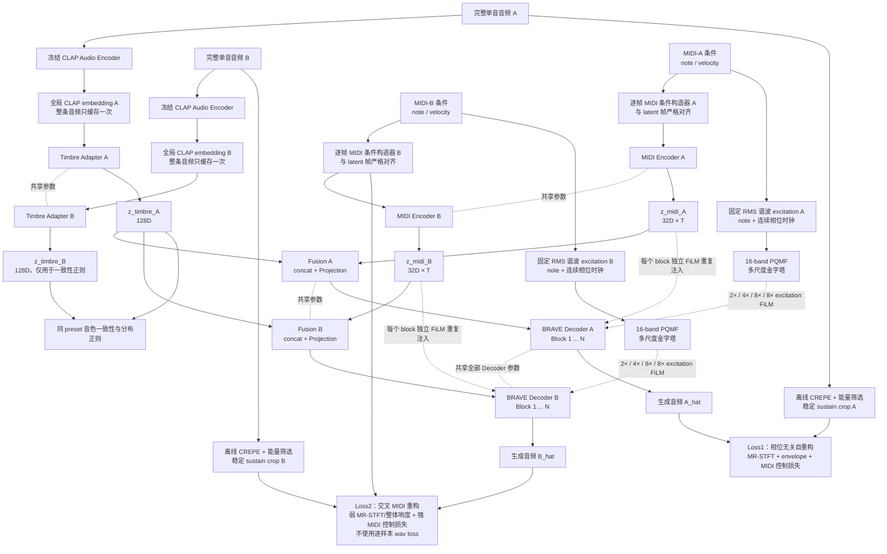

# 方案 A：双分支 MIDI 条件音频重构训练方案

本文档在[《Boids 潜空间漫游单音乐器技术方案》](./Boids%20潜空间漫游单音乐器技术方案.md)的训练架构上，补充一次训练同时完成自重构与交叉 MIDI 重构的实现规格。训练阶段不接入 Boids Engine；Boids 只在后续推理阶段替换训练期的音色潜变量来源。

## 1. 目标与原则

最终模型是一个从头训练、可实时流式运行的单音乐器神经音频 Decoder：

- MIDI 独立控制目标音高和力度；
- `z_timbre` 只负责音色，不负责目标音高和力度；
- 训练时使用冻结的 CLAP Audio Encoder 和可训练 Timbre Adapter 得到 `z_timbre`；
- 推理时才由 Boids Latent Mapper 提供同维度、同分布的音色潜变量；
- 完整复用方案 A 的逐帧 MIDI 条件构造器、Fusion Projection，以及在每个 Decoder block 中独立重复注入 `z_midi` 的 FiLM 结构；
- 由 MIDI note 确定性生成连续谐波 excitation，经同一 16-band PQMF 和多尺度下采样后注入各 Decoder stage，为常量 sustain 条件提供必需的波形相位时钟；
- 每个训练 pair 同时生成两段音频：自身重构 `A_hat` 和交叉 MIDI 重构 `B_hat`。

## 2. 双分支训练流程图



图中的 Decoder A/B 表示同一组权重在两个条件组合上的计算。实现时应将两路 latent 沿 batch 维拼接，只执行一次共享 Decoder forward，再按分支拆分输出和损失。

## 3. 模型配置

### 3.1 音频与 BRAVE Decoder

|配置|固定值|
|---|---|
|采样率|44,100 Hz|
|声道|mono|
|训练格式|float32；模型前归一化|
|PQMF|16 bands|
|Decoder capacity|64|
|Decoder ratios|`[2, 2, 2, 1]`|
|总时间倍率|`16 × 8 = 128 samples/latent frame`|
|latent 帧间隔|约 2.902 ms|
|训练窗口|65,536 samples，即512 latent frames、约1.486秒|
|`z_timbre`|128D|
|`z_midi`|32D|

Decoder 沿用 BRAVE/RAVE-style 的因果卷积上采样和多频带波形输出骨架，但所有生成参数从头训练，不加载普通 RAVE Decoder 权重。

### 3.2 音色分支

每条完整单音生成一个固定 CLAP embedding，禁止把同一单音裁出的不同随机窗口分别送入 CLAP。CLAP checkpoint、预处理版本、音频 hash 和 embedding hash 必须记录在缓存元数据中。

CLAP 全程冻结，Timbre Adapter 使用：

```text
CLAP_DIM
→ Linear(CLAP_DIM, 256)
→ SiLU
→ Linear(256, 128)
→ LayerNorm
→ tanh
→ z_timbre
```

`z_timbre_A` 在时间维复制到 Decoder 所需的 latent 帧数。`z_timbre_B` 不进入交叉 Decoder，只用于约束同一 preset、同一 articulation 在不同 MIDI 下产生一致的音色表示。

### 3.3 逐帧 MIDI 条件构造器

离散 MIDI 事件必须先按 sample timestamp 映射到128 samples一帧的 latent 时间轴，再送入 MIDI Encoder。每帧包含：

|字段|构造规则|
|---|---|
|`note_id`|0–127|
|`target_pitch`|由 note 和固定调律换算得到的目标频率|
|`velocity`|`velocity / 127`|

不构造 gate、pitch bend、onset/offset pulse、legato、ADSR 阶段或 release 状态。当前数据中的 note 和 velocity 在训练窗口内展开为逐帧条件。

MIDI Encoder 由 note embedding、连续控制量 MLP 和轻量因果 TCN 组成，输出形状为 `[B, 32, T_latent]`。同一 MIDI Encoder 同时处理 A、B 两路条件。

### 3.4 MIDI 派生谐波 excitation

仅将恒定的 note/velocity 张量送入卷积网络时，warm-up 后所有时序特征都会趋于常量，无法生成36–71各音高所需的连续波形。因而训练前向必须保留 Pitch-conditioned BRAVE 已验证的显式激励路径：

```text
MIDI note
→ f0 = 440 × 2^((note - 69) / 12)
→ 固定 RMS、带 Nyquist harmonic mask 的谐波 excitation
→ 与 Decoder 输出共用的 16-band PQMF analysis
→ 因果下采样金字塔 [2×, 4×, 8×, 8×]
→ 每个 stage 独立、零初始化的 excitation FiLM
```

该 excitation 只由 `note + sample clock` 确定性推导，不是新 MIDI 字段，也不引入 gate、pitch bend、periodicity、ADSR、onset/offset 或任何额外标签。其 RMS 固定为0.1，不随 velocity 缩放；velocity 对响度和频谱的影响仍由32D `z_midi` 从真实 velocity 50/127数据中学习。训练窗口可从固定初相位开始并依靠 warm-up 丢弃边界；后续实时导出必须把相位作为每个 voice 的连续状态保存。

### 3.5 Fusion 与重复注入

Fusion Projection 显式保留，不并入 Decoder 第一层：

```text
concat(z_timbre, z_midi)  # 128D + 32D
→ 1×1 Conv(160, 1024)
→ SiLU
→ 1×1 Conv(1024, 1024)
→ h0
```

每个 Decoder block 都配置独立的 FiLM 映射：

```text
(delta_gamma_l, beta_l) = FiLM_l(z_midi)
h_l_conditioned = (1 + delta_gamma_l) * h_l + beta_l
```

- FiLM 权重和偏置零初始化，初始状态为恒等映射；
- `z_midi` 按各 block 的时间分辨率进行因果最近邻展开；
- 禁止只在 Decoder 入口注入 MIDI；note 和 velocity 必须贯穿所有上采样层。
- 各上采样 stage 同时接收独立的 excitation FiLM；它与32D MIDI FiLM 分开投影，二者均以恒等映射初始化。

倍率2的最近邻上采样后使用31-tap固定 Kaiser 抗镜像低通。训练前向先生成64个 latent frame 的 warm-up 并丢弃对应输出，避免随机 sustain 窗口被 Decoder 冷启动误当作 onset；PQMF 额外生成右侧滤波尾帧后再裁取目标窗口。

模型接口固定为：

```text
encode_timbre(clap_embedding) -> z_timbre
encode_midi(midi_frames) -> z_midi
decode(z_timbre, z_midi) -> waveform
forward_pair(clap_A, midi_A, midi_B) -> waveform_A_hat, waveform_B_hat
```

## 4. A/B 数据配对与窗口采样

一个训练 pair 必须满足：

```text
source_id_A       == source_id_B
preset/timbre_A   == preset/timbre_B
articulation_A    == articulation_B
sample_id_A       != sample_id_B
```

MIDI 差异采用固定分层比例：

- 50%：音高不同，velocity 相同；
- 25%：音高相同，velocity 不同；
- 25%：音高和 velocity 同时不同。

每轮以50%概率交换 A/B 方向，确保每条音频都能作为 `z_timbre` 来源和交叉目标。原始 WAV 保留完整 attack、sustain 和 release，CLAP 与质检使用完整音频；Decoder 窗口只从离线 CREPE 与能量共同确认的稳定 sustain 区间裁剪。A/B 不要求波形相位一致，宿主负责最终 note-on/note-off 包络。

每个 PairBatch 至少包含：

```text
audio_A, audio_B
clap_A, clap_B
midi_frames_A, midi_frames_B
f0_hz, f0_confidence, pitch_valid_mask_A/B
source_id, preset_id, articulation_id, sample_id_A/B
```

窗口级 RMS/整体响度直接从 `audio_A/B` 在线计算，不要求数据集提供额外的响度或包络标签。

必须先按完整 `sample_id` 划分 train/validation/test，再在各集合内部建立 pair 和训练窗口。禁止在窗口生成后随机划分，禁止跨集合配对。

## 5. 损失函数

### 5.1 Loss1：自身 MIDI 与自身音频重构 A

`A_hat = Decoder(z_timbre_A, z_midi_A)`，与真实 A 比较完整重构损失：

|损失|初始权重|
|---|---:|
|fullband + multiband MR-STFT|1.00|
|多尺度 log-envelope 与一阶差分|0.05|
|MIDI 目标 cents/F0|0.50|
|窗口级整体响度/RMS|0.25|

MR-STFT 使用 `[2048, 1024, 512, 256, 128]` 五组全频尺度及真正的16-band PQMF 子带尺度。Envelope 使用 `[1024, 4096, 16384]` samples 三尺度；最短窗口仍长于 MIDI 36 的一个周期，避免短窗能量重新惩罚随机载波相位。Decoder 不接收目标相位或裁剪 offset，因此 A/B 两路的逐样本 waveform loss 都固定为0。

### 5.2 Loss2：A 的音色与 MIDI-B 重构 B

`B_hat = Decoder(z_timbre_A, z_midi_B)`，同时接受真实 B 的弱声学监督和 MIDI-B 的强控制监督：

|损失|初始权重|
|---|---:|
|B_hat 对真实 B 的 fullband + multiband MR-STFT|0.25|
|逐样本 waveform loss|0，明确禁用|
|多尺度 log-envelope 与一阶差分|0.0125|
|B_hat 对 MIDI-B 的 cents/F0|2.00|
|B_hat 对真实 B 的窗口级整体响度/RMS|0.50|

F0 目标由注入的 MIDI-B note 按固定调律换算，不得误用 MIDI-A。F0 loss 仅在真实 B 的离线 CREPE `pitch_valid_mask` 和 confidence 合格帧上计算；训练绕过不可微的 `torchcrepe.predict()`，冻结 CREPE Tiny 内部网络但保留生成波形的反向梯度。

velocity 不使用 ADSR 监督，而是在同 note、不同 velocity 且真实响度方向有效的 pair 上计算生成波形 dB RMS 排序；等 velocity 或不同 note 时严格为0。该 ranking 初始权重为0.50；MR-STFT 同时监督 velocity 引起的动态音色。

### 5.3 音色解耦与分布正则

附加损失为：

```text
L_timbre_pair = 0.10 * (1 - cosine(z_timbre_A, z_timbre_B))
L_distribution = 0.01 * latent_distribution_regularization
L_pitch_adversary = 0.10 * pitch_adversarial_loss

L_phase1 = Loss1 + Loss2
         + 0.50 * L_velocity_ranking
         + L_timbre_pair
         + L_distribution
         + L_pitch_adversary
```

pitch adversary 在100k step后通过 gradient reversal 启用，用于降低 `z_timbre` 对源 MIDI note 的可预测性。音色一致性和分布正则必须同时存在，避免所有 preset 向同一个 latent 点塌缩。

## 6. 两阶段训练

### 6.1 Phase 1：表示与重构

- 训练 Timbre Adapter、MIDI Encoder、Fusion、全部 MIDI FiLM 和 Decoder；
- CLAP 与音高检测器冻结；
- A/B 双分支从第一个 step 同时启用；
- 训练1,000,000 optimizer steps；
- AdamW，主网络初始学习率 `2e-4`；
- 前10k steps线性 warmup，之后 cosine decay 到 `2e-5`。

### 6.2 Phase 2：RAVE 式对抗微调

加入多尺度/多周期 Discriminator、hinge adversarial loss 和相位无关 feature-statistics matching：

```text
L_phase2 = L_phase1
         + 1.0 * L_adversarial
         + 2.0 * (L_feature_stats_A + 0.25 * L_feature_stats_B)
```

- 训练250,000 steps；
- Decoder、Fusion、FiLM 学习率 `1e-5`；
- Timbre Adapter、MIDI Encoder 学习率 `1e-6`；
- Discriminator 学习率 `2e-4`；
- 继续保留 MR-STFT、包络、F0 和窗口级整体响度约束；
- feature matching 只比较各判别器层的时间均值、对数标准差与差分能量，不逐位置匹配特征，避免重新引入载波相位监督；
- 统计型 feature matching 的原始量级约2–3，外层权重校准为2.0，使其保持辅助去伪影项而不压过重建/MIDI损失；
- 若对抗训练导致 MIDI 控制指标相对 Phase 1 最佳 checkpoint 退化超过10%，拒绝该 checkpoint。

## 7. Octopus 训练配置

- 8×V100 DDP，使用 `gpu8` 分区和 `--gres=gpu:8`；
- Docker 必须使用 `--gpus "device=$CUDA_VISIBLE_DEVICES"`，禁止 `--gpus all`；
- FP16 + GradScaler，不使用 BF16 或 Flash Attention 2；
- 每 GPU 每次1个 A/B pair，梯度累积8次；
- 全局每次 optimizer step 为64 pairs、128段生成音频；
- gradient clipping 固定为1.0；
- checkpoint 保存模型、Discriminator、优化器、scheduler、GradScaler、DDP sampler、全局 step 和固定 CLAP 配置。

## 8. 测试与验收

### 8.1 实现测试

- MIDI 条件到 latent frame 的映射必须通过 note 和 velocity 单元测试；
- 验证条件构造器不生成 gate、pitch bend、onset/offset、legato、ADSR 或 release 字段；
- 验证每个 Decoder block 都收到对应分支的独立 FiLM；
- FiLM 零初始化时，调制前后结果必须一致；
- 验证 A/B 两路都没有 waveform loss，MR-STFT、包络、F0 和 RMS 能向 Decoder 传播梯度；
- 验证 Loss2 的 F0 目标来自 MIDI-B，而不是 MIDI-A 或音频 A；
- 验证 CLAP 和音高检测器参数无梯度更新，但 F0 loss 能向 Decoder 传播；
- 验证 pair 不跨 train/validation/test，且窗口不造成 `sample_id` 泄漏；
- 1 GPU 与8 GPU在相同 seed 下完成 loss、梯度和 checkpoint resume 一致性测试。

### 8.2 小数据过拟合门槛

先使用一个 preset、至少12个音高和 velocity 50/127：

- 固定 `z_timbre_A`，仅改变 MIDI-B 时，输出基频必须随 MIDI-B 改变；
- MIDI-B 与 MIDI-A 不同时，`B_hat` 的 F0 更接近 MIDI-B 的比例不低于99%；
- velocity-only pair 的生成响度顺序必须正确；

### 8.3 完整验证门槛

|指标|门槛|
|---|---:|
|渲染数据 median F0 error|≤25 cents|
|真实录音 median F0 error|≤40 cents|
|octave error|<1%|
|MIDI swap 跟随率|≥99%|
|同 note velocity 排序正确率|≥95%|
|生成与真实 velocity ΔdB 中位绝对误差|≤2 dB|
|稳定 sustain 有效帧覆盖率|≥95%|
|`z_timbre` 线性 note probe|不高于随机水平的2倍|

除指标外，还需固定输出同一 `z_timbre` 下的36–71音高网格、velocity 网格和 A/B swap 样例，进行频谱图与听感检查。

## 9. 当前阶段边界

本阶段只实现训练数据接口、双分支模型前向、损失、训练调度和验证：

- 不接入 Boids Engine；
- 不训练 Boids Latent Mapper；
- 不实现实时宿主和最终模型导出；
- 暂不拉取正式训练数据；
- 不引入 gate、pitch bend、ADSR、onset/offset、legato 或 release 标签与损失；
- gate 的推理行为不由本训练模型学习，留给后续宿主或独立控制方案处理；
- A/B 两路都采用相位无关重建；B 分支固定为“真实 B 的弱频谱/包络/整体响度重构 + MIDI-B 的强音高和力度损失”。
