## 一、项目说明

### 1.1 作品简介

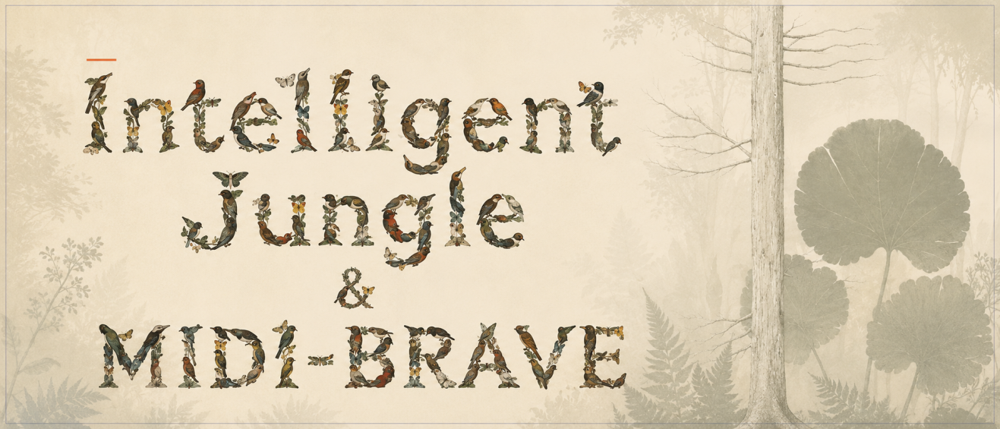

Intelligent Jungle 是一个实时生成音乐系统,传统合成器依赖数百个参数调节,Intelligent Jungle探索一种新的“可演奏AI乐器”:用户通过空间行为和生态交互持续塑造声音。核心设定为「生态系统即音序器」:森林对应音序网格,鸟群行为对应音符事件,潜空间对应发声体。

系统将一棵「树」建模为 5 条音高枝 × 16 步的符号音序网格。鸟的栖落位置决定音高,栖落时刻决定起音,驻留时长决定时值。一个昼夜构成一轮完整的音乐循环(4 小节 × 4 拍),四季构成更长尺度的演化。系统记录每日生态状态,并在次日延续、修正或变异。规则本身不含任何音乐词汇,节奏、织体与结构由生态活动自发产生。

生态之上运行五个分工明确的音乐智能体。一个 **Master Agent** 管理全局环境与音乐结构(时间、季节、天气、和弦进行、色彩、张力、速度);四个 **Flock Agent** 各负责一个声部:Pad(斑鸠,长驻和声铺底)、Melody(百灵,单音旋律与动机变奏)、Bass(鹈鹕,低频锚点)、Jungle(啄木鸟,Amen break 切片与句尾变化)。五个智能体在同一符号世界中持续决策、互相约束、共同演化:Master 提供共享的时间与和声环境,四个 Flock 在统一网格上写入各自的音高、起音与时值。传统音乐系统中，结构、旋律、音色通常由固定规则控制。本系统通过Master Agent与Flock Agent分工，让音乐结构决策和局部行为演化同时进行。

所有发声单元由团队<strong><u>在黑客松赛事期间立项并全链路完成的自研的潜空间实时解码神经音频模型 MIDI-BRAVE</u></strong> 驱动。符号音乐层决定音符的触发时刻、音高与时值;生态关系(栖驻、能量、邻群活动等)映射为连续潜空间坐标,神经解码器逐块实时生成音频波形。音高精确可控,音色可在语义空间中连续漫游。

交互方面,用户可随时接管任一声部,放置、移动或移除鸟;其余声部与 Master 保持自主运行。用户行为写入生态状态,交还控制权后,智能体从修改后的状态继续演化。

整套系统完全运行于端侧:五个智能体的决策与 7 路神经音频解码部署在同一台 NVIDIA DGX Spark 上,浏览器仅承担交互、可视化与最终混音。无公网延迟,无云端算力依赖。

### 1.2 核心亮点

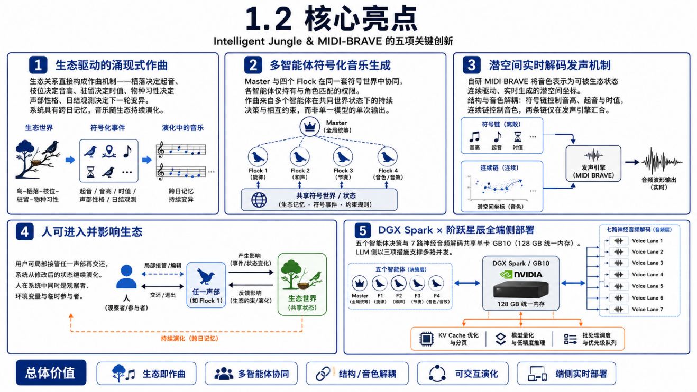

1.  <strong>生态驱动的涌现式作曲:</strong>生态关系直接构成作曲机制——栖落决定起音、枝位决定音高、驻留决定时值、物种习性决定声部性格、日结观测决定下一轮变异。系统具有跨日记忆,音乐随生态持续演化。
2.  **多智能体符号化音乐生成**:Master 与四个 Flock 在同一套 5×16 符号世界中协同,各智能体仅持有与角色匹配的权限。作曲来自多个智能体在共同世界状态下的持续决策与相互约束,而非单一模型的单次输出。
3.  **潜空间实时解码发声机制**:自研 MIDI-BRAVE 将音色表示为可被生态状态连续驱动、实时生成的潜空间坐标。结构与音色解耦:符号链控制音高、起音与时值,连续链控制音色,两条链仅在发声引擎汇合。
4.  **人可进入并影响生态**:用户可局部接管任一声部再交还,系统从修改后的状态继续演化。人在系统中同时是观察者、环境变量与临时参与者。
5.  **DGX Spark × 阶跃星辰全端侧部署**:五个智能体决策与 7 路神经音频解码共享单卡 GB10(128 GB 统一内存)。LLM 侧以三项措施支撑多路并发:INT4 AWQ 量化 + vLLM text-only 模式(加载时跳过视觉塔,显存中仅 6 GiB 语言模型);KV 池按需配比(16 并发聚合 620 tok/s,首 token 延迟 50–90 ms);结构化输出强制 JSON 契约。神经音频侧采用固定 7 行 voice 池 + 持久 CUDA stream 并行,满载 p95 33.83 ms,在 46.44 ms 音频块预算内保留约 27% 余量。

### 1.3 架构设计

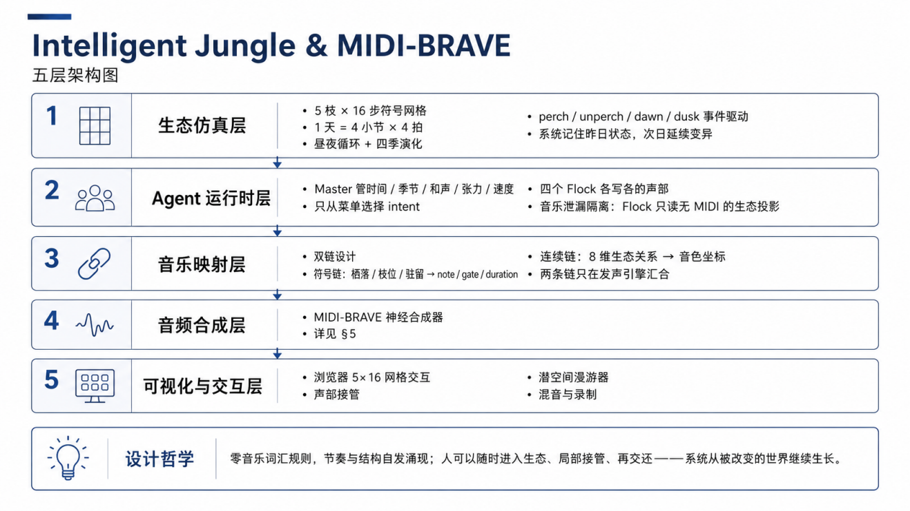系统自底向上分为五层。MIDI-BRAVE 神经合成器为团队核心技术资产,在 1.3.4 单独展开。

#### 1.3.1 生态仿真层

-   世界模型:5 条音高枝 × 16 步符号网格,统一地址 `{treeId, pitchBranchId, stepIndex}`。
-   时间结构:1 天 = 4 小节 × 4 拍;Jungle 声部双倍速播放头;昼夜循环驱动智能体日结评审(dayReview),四季构成更长尺度演化。
-   事件驱动:`perch / unperch / dawn / dusk` 为系统事实,音频、渲染、评分为订阅者。
-   能量经济:按声部启用的八指标经济框架;和谐分 H 独立观测,不直接计入总分。
-   记忆与变异:系统记录昨日占用格,次日 cell mutation 必须从昨日占用格原子移动至同网格空格,保证音乐动机可延续、可变异。

#### 1.3.2 Agent 运行时层(五个智能体)

-   **Master Agent**:管理全局环境与音乐结构,仅从季节和声菜单中选择 progression / color / tension / tempo intent。
-   **四个 Flock Agent**(Pad/Melody/Bass/Jungle):输出 `dwellBeats / activeBars / holdLoops / cellMutations`,各自持有与角色匹配的行为权限。Flock 仅读取无 MIDI 的生态投影,和声决策权收敛于 Master(音乐泄漏隔离)。
-   **推理组织**:四个 Flock 合并为一次推理请求,Flock 与 Master 决策并行;全部以 `json_schema` 约束输出,代码侧执行菜单校验、数值 clamp 与非法整包回退。
-   **调度可靠性**:single-flight、按日退避、连续失败断路器;决策响应错过黎明则延后应用,不打断播放走带(transport)。
-   **运行时预计算**:阈值与边界判断由本地程序预计算为布尔 flags,模型仅负责意图与策略。规则层与 LLM 使用同一输入投影、同一安全菜单与同一应用接口,可无缝降级。

#### 1.3.3 音乐映射层

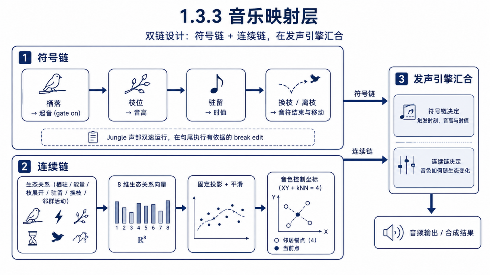

-   符号链:栖落 → 起音(gate on);枝位 → 音高;驻留 → 时值;换枝/离枝 → 音符结束与移动。Jungle 声部双速运行,在句尾执行有依据的 break edit。
-   连续链:生态关系(栖驻/能量/枝展开/驻留/换枝/邻群活动)→ 8 维生态关系向量 → 固定投影 + 平滑 → 音色控制坐标(XY + kNN=4)。
-   两条链在发声引擎汇合:符号链决定触发时刻、音高与时值;连续链决定音色如何随生态变化。

#### 1.3.4 音频合成层:MIDI-BRAVE 神经合成器

**(1) 基座:BRAVE 流式神经音频架构**

BRAVE 是 RAVE 家族的流式神经音频模型:编码器将音频压缩为连续、低速率的潜空间序列,因果卷积解码器逐块重建波形。经对抗微调后,44.1 kHz 下可达数倍于实时的生成速度,全因果结构天然支持流式推理。

选择 BRAVE 作为发声基座,基于三点判断:

-   **流式可行**:因果卷积 + 逐块解码,音频按块持续生成、边算边播,满足 16 步进时钟下的实时发声要求;
-   **潜空间可演奏**:连续、低维的 latent 构成可连续遍历的音色空间,生态状态可映射为潜空间坐标,驱动音色连续变化;
-   **可条件化**:解码器输入侧可拼接外部条件序列,为注入音高与音色条件提供干净的架构接口。

**(2) 音色与音高双条件注入**

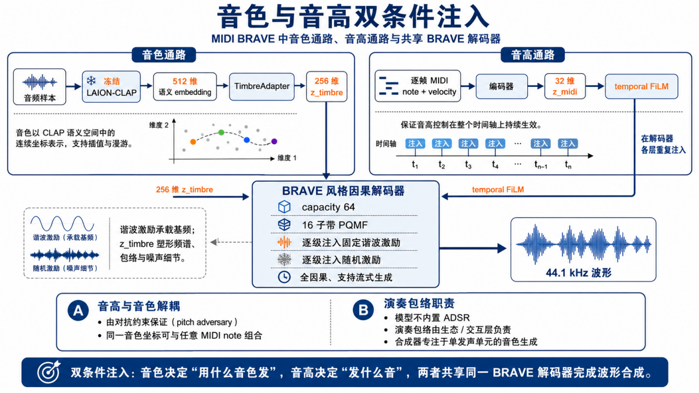

MIDI-BRAVE 将「发什么音」与「用什么音色发」拆分为两条独立条件通路,共享同一个 BRAVE 解码器:

-   **音色通路**:冻结的 LAION-CLAP 将音频编码为 512 维语义 embedding,经可训练的 TimbreAdapter 压缩为 **256 维 z\_timbre**。音色以 CLAP 语义空间中的连续坐标表示,支持插值与漫游;
-   **音高通路**:逐帧 MIDI note + velocity 编码为 32 维 z\_midi,在解码器各层通过 **temporal FiLM** 重复注入,保证音高控制在整个时间轴上持续生效;
-   **解码器**:BRAVE 风格因果解码器(capacity 64,16 子带 PQMF),逐级注入固定谐波激励与随机激励。谐波激励承载基频,z\_timbre 塑形频谱、包络与噪声细节,输出 44.1 kHz 波形。

音高与音色的解耦由对抗约束保证(见 (7) pitch adversary),同一音色坐标可与任意 MIDI note 组合。模型不内置 ADSR:演奏包络由生态/交互层负责,合成器专注于单发声单元的音色生成。

**(3) 四类独立模型,200 个入选音色**

Pad、Lead、Bass、Pluck 四类声音的时间结构差异显著(长持续慢演化 / 清晰起音 / 低频基音 / 快速瞬态),压入同一潜空间会互相稀释。MIDI-BRAVE 训练四套独立模型:共享总体架构与接口,不共享权重、anchor table 与音色潜空间,仅允许同类内部插值与漫游。

数据来自经质量检查的 开源合成器插件dexed 的音色库:每类从 Top400 候选池(合计 1,600 个互不重复音色、93,924 条音频片段、约 129.8 小时)按冻结评分精选 Top50,共 **200 个入选音色**(约 1.0 万条训练 WAV)。按 preset 划分 45 train / 2 validation / 3 test,杜绝同一音色跨集合泄漏；pitch覆盖三个八度，velocity 覆盖 50 与 127。类别筛选综合标签证据与 CLAP 音频-文本语义相似度(0.8/0.2 加权,按来源 percentile 归一化)，并进行全局互斥分配。

**(4) 固定 7 行神经 Voice 池**

-   DGX Spark 上 `brave-voices` 后端固定 7 行:bass ×1、lead/melody ×1、pluck ×1、pad ×4。
-   固定池设计避免动态 batch 变化导致跨块状态清零与声部爆音;未发声行 `gate=0` 常驻,不重建 batch 与 decoder state。
-   pad 四行共享同一只读模型权重,仅保持独立 streaming state:可产生真实四音和弦,且不重复占用显存。

**(5) 生态 → 潜空间映射与音色漫游**

-   8 维生态关系向量经固定投影 + 平滑得到音色控制坐标;鸟群关系变化时坐标随之移动,解码器逐块生成新的音频波形。
-   每个声部持有各自的训练 anchor 地图;自动路径仅使用 XY + kNN=4,在真实训练点凸包内混合,保证音色漫游落在已验证的安全区域。
-   音色变化由模型在潜空间中实时合成,不依赖预设切换。

**(6) 流式实时推理与传输**

-   浏览器通过 WebSocket 接收 float32 PCM,AudioWorklet 播放;EQ、FX、混响、昼夜宏保留在浏览器混音总线。
-   Jungle/Texture 声部当前使用真实 Amen sample 的浏览器颗粒切片。

**(7) 训练方案与结果**

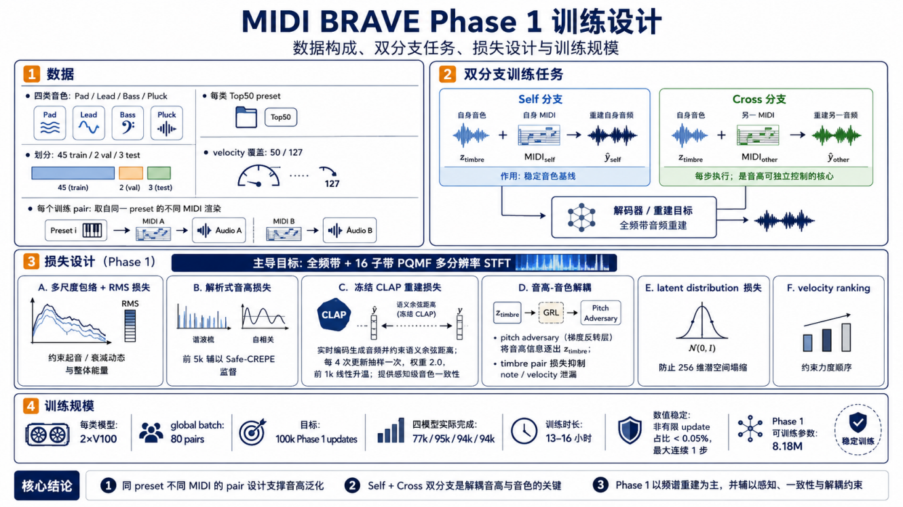

-   数据:四类(Pad/Lead/Bass/Pluck)各 Top50 preset(45 train / 2 val / 3 test),velocity 覆盖 50/127;每个训练 pair 取自同一 preset 的不同 MIDI 渲染。
-   双分支训练任务:**Self 分支**(自身音色 + 自身 MIDI → 重建自身音频)稳定音色基线;**Cross 分支**(自身音色 + 另一 MIDI → 重建另一音频)每步执行,是音高可独立控制的核心。
-   损失设计(Phase 1,以全频带 + 16 子带 PQMF 多分辨率 STFT 为主导):
    -   多尺度包络 + RMS 损失,约束起音/衰减动态与整体能量;
    -   每步解析式音高损失(谐波梳 + 自相关),前 5k 辅以 Safe-CREPE 监督;
    -   **冻结 CLAP 重建损失**:对生成音频实时编码并约束语义余弦距离(每 4 次更新抽样一次,权重 2.0,前 1k 线性升温),提供感知级音色一致性;
    -   **音高-音色解耦**:为了避免音色空间受到音高影响,模型加入音高解耦约束,使同一音色可以跨不同音符复用。pitch adversary 通过梯度反转层将音高信息逐出 z\_timbre,timbre pair 损失抑制 note/velocity 泄漏;
    -   latent distribution 损失防止 256 维潜空间塌缩;velocity ranking 约束力度顺序。
-   训练规模:目标 100k updates;四模型分别完成 77k / 95k / 94k / 94k 次更新(13–16 小时),数值稳定(非有限 update 占比 &lt; 0.05%,最大连续 1 步);模型可训练参数 8.18M。
-   结果(训练日志末 5k 均值 + 固定验证):
    -   四类模型均学到有效波形重建与 MIDI 音高约束(Cross pitch 0.017–0.039);末 5k Cross CLAP 较 40k–50k 区间下降 6.1%–16.5%;
        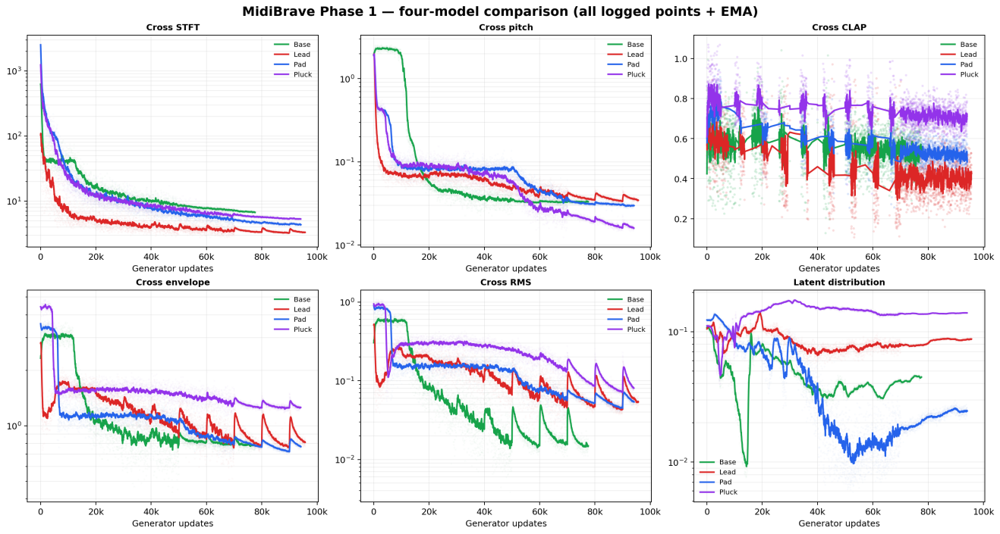
    -   固定验证(每类 96 个不可变 cases)中 Pluck 五项指标全部改善;其余类别呈混合结果。
        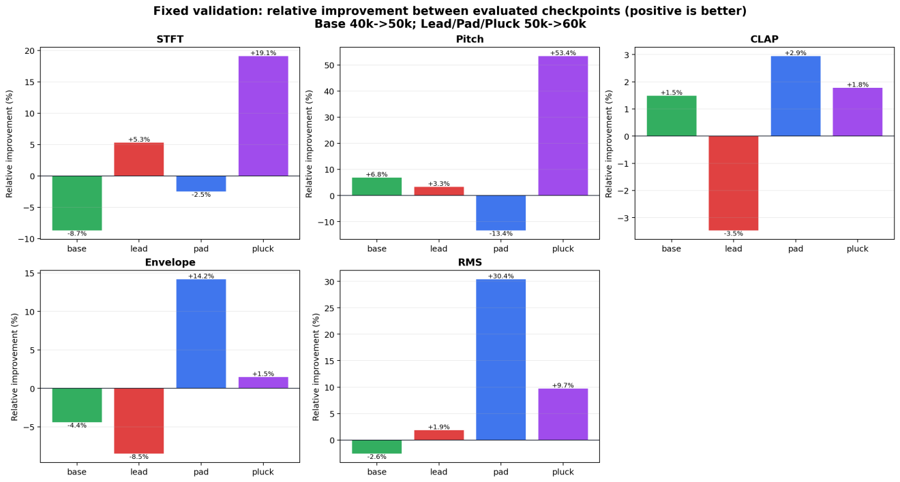

#### 1.3.5 可视化与交互层

-   浏览器前端:5×16 Sequence 网格交互、全树/单声部视图、生态结算与「林群回应」面板(智能体下一日意图)、四轨响度表。
-   声部接管:一键接管任一声部(状态从「自主演化」变为「用户接管」),放置/移动/移除节点即时发声,交还后智能体从修改后的状态继续演化。
-   潜空间漫游器:手动 XY/kNN 漫游与自动漫游切换,音色连续变化实时可听。
-   录制:来自最终 MediaStream,捕获实际听到的混音,不依赖符号地址。

### 1.4 优化方案

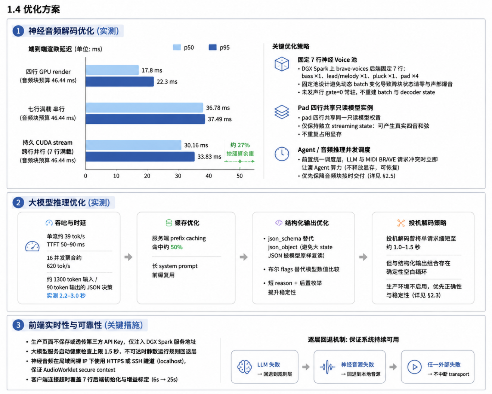

**神经音频解码优化(实测)**

-   四行 GPU render p50 / p95 = **17.8 / 22.3 ms**(音频块预算 46.44 ms);七行满载串行 p50 / p95 = 36.78 / 37.49 ms。
-   持久 CUDA stream 跨行并行后 p50 / p95 = **30.16 / 33.83 ms**,保留约 27% 块预算余量。
-   pad 四行共享只读模型实例;固定 7 行池 + `gate=0` 常驻,避免重建 batch 与 decoder state。
-   **Agent / 音频推理并发调度**:前置统一调度层,LLM 与 MIDI-BRAVE 请求冲突时立即让渡 Agent 算力(不释放显存、可恢复),优先保障音频块按时交付(详见 §2.5)。

**大模型推理优化(实测)**

-   单流约 39 tok/s,TTFT 50–90 ms;16 并发聚合约 620 tok/s;约 1300 token 输入 / 90 token 输出的 JSON 决策实测 2.2–3.0 秒。
-   服务端 prefix caching 命中约 50%,长 system prompt 前缀复用。
-   `json_schema` 替代 `json_object`(避免大 state JSON 被模型原样复读);布尔 flags 替代模型数值比较;短 reason + 后置枚举提升稳定性。
-   投机解码曾将单请求缩短至约 1.0–1.5 秒,但与结构化输出组合存在确定性空白循环,生产环境不启用,优先正确性与稳定性(详见 §2.3)。

**前端实时性与可靠性**

-   生产页面不保存或透传第三方 API Key,仅注入 DGX Spark 服务地址。
-   大模型服务启动健康检查上限 1.5 秒,不可达时静默运行规则回退层。
-   神经音频在局域网裸 IP 下使用 HTTPS 或 SSH 隧道(localhost),保证 AudioWorklet secure context;客户端连接超时覆盖 7 行后端初始化与增益标定(6s → 25s)。
-   逐层回退:LLM → 规则;神经音源 → 本地音源;任一外部失败均不停止 transport。

##  二、部署说明

### 2.1 硬件环境

-   NVIDIA DGX Spark:单卡 GB10(Grace Blackwell,128 GB 统一内存,aarch64,sm\_121,CUDA 13),承载全部 LLM 推理与神经音频解码。
    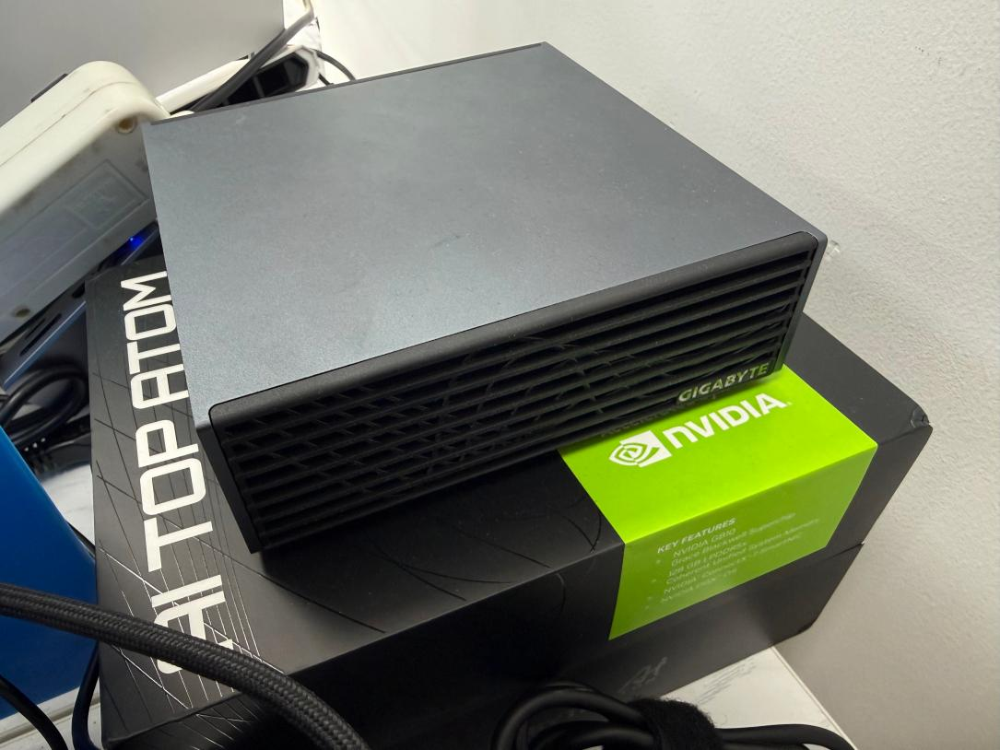

### 2.2 本地智能体部署(五个智能体共用)

-   推理框架:vLLM 0.25.1(arm64,docker `vllm/vllm-openai:latest`)
-   模型:阶跃星辰 Step3-VL-10B,INT4 AWQ(compressed-tensors 格式,权重 9.7 GiB),text-only 模式运行(ViT 不加载,显存中仅 6 GiB)
-   服务端点:OpenAI 兼容 API,服务名 `bird_agent` @8081;结构化输出后端 xgrammar(`disable_any_whitespace`)
-   性能:TTFT 50–90 ms;单流约 39 tok/s;16 并发聚合约 620 tok/s
-   调用组织:四个 Flock 合并单次请求,Flock 与 Master 并行;调度器含 single-flight / 按日退避 / 断路器

### 2.3 大模型优化措施

**0) 选型依据:四后端实测对比**

全部优化决策基于同一台 DGX Spark、同一客户端脚本、同一 prompt 集的四后端对比实验(vLLM-INT4 / llama.cpp-Q4 / SGLang-FP8 / vLLM-FP8):、

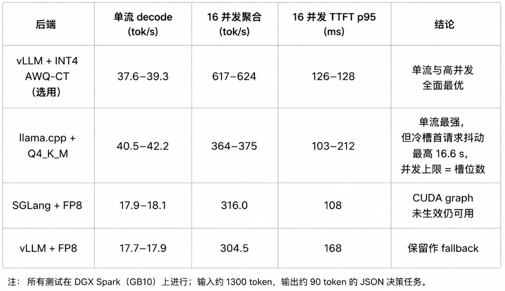

多智能体场景的典型负载为「简单决策 × 多路并发」,对应 vLLM 连续批处理的优势区间:617+ tok/s 聚合吞吐意味着 10 个智能体同时决策时每个仍有约 40 tok/s。精度抽查(翻译/代码/数值比较/信息抽取/指令遵循 5 题)显示 INT4 与 FP8 无可见差异。TensorRT-LLM 与 LMDeploy 不支持 Step3-VL,直接排除。

围绕「10B 模型在单卡 GB10 上承载多智能体高频并发调用」这一目标,实施四层优化:

**1) 量化与权重格式选型**

-   目标:INT4 量化,将 10B 模型权重压至 10 GiB 以内,为 KV cache 与神经音频任务预留显存。
-   路线对比:
    -   GGUF:llama.cpp 可用但 vLLM 不支持,放弃;
    -   AutoAWQ 格式:`modules_to_not_convert` 保留 qkv 层,与 vLLM 加载器冲突,无法加载,放弃;
    -   **compressed-tensors INT4 AWQ**(最终采用):vLLM 原生支持,权重 9.65 GiB,加载稳定。
-   以 text-only 模式启动(`--limit-mm-per-prompt image=0`),加载时跳过视觉塔(ViT),显存中的模型从 9.65 GiB 降至 **6.02 GiB**。

**2) KV cache 配比调优**

-   vLLM 按 `--gpu-memory-utilization` 比例预分配 KV 池。从 0.80 下调至 **0.575**,在保证 16 路并发容量(可用 KV cache 61.38 GiB)的前提下,为同卡神经合成任务预留约 30 GiB 显存。
-   `--max-model-len 32768`,覆盖智能体 state JSON 的长上下文;开启 prefix caching(实测命中约 50%),多智能体共享的系统 prompt 前缀仅计算一次。

**3) 结构化输出与约束解码(对小模型收益最大的一项)**

-   全部智能体调用强制 `response_format=json_schema`:输出契约稳定,同时消除 Step3-VL-10B 默认的长篇思维链,输出 token 数与延迟显著下降。
-   约束解码后端 xgrammar,配置 `disable_any_whitespace: true`,根治引导解码下模型无限输出合法 JSON 空白的问题。
-   schema 设计配合小模型特性:枚举/规则编号类字段置于 reason 字段之后,避免被第一条规则锚定;自由文本字段以 `pattern` 限定字符集与长度(4\~30 字),不使用 `maxLength` 硬截断(截断会诱发无限空白循环)。
-   数值阈值与几何判断不交给模型:由运行时在 state 中预计算为布尔 flags,10B 模型仅负责优先级判断与映射,误判率显著降低。

**4) 投机解码实验(未上生产)**

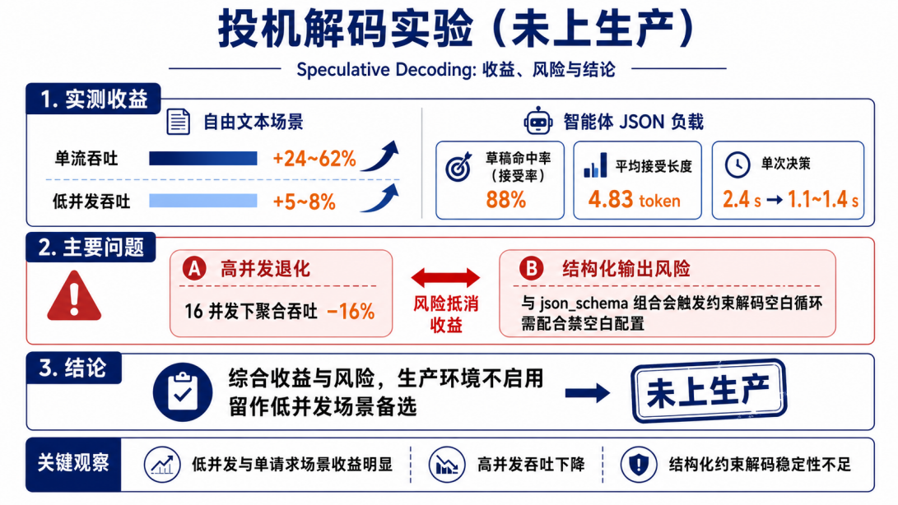

-   n-gram 投机解码实测:自由文本单流吞吐 +24\~62%,低并发 +5\~8%;智能体 JSON 负载的草稿命中率(接受率)达 88%、平均接受长度 4.83 token,单次决策 2.4s→1.1\~1.4s。
-   但 16 并发下聚合吞吐 −16%,且与 json\_schema 组合会触发约束解码空白循环(需配合禁空白配置)。综合收益与风险,生产环境不启用,留作低并发场景备选。

### 2.4 MIDI-BRAVE 神经合成器部署

-   部署位置:与 LLM 同台 DGX Spark,`brave-voices` 后端服务。
-   模型构成:MIDI-BRAVE 四类独立模型(Pad / Lead / Bass / Pluck;CLAP 512D → 256D z\_timbre 音色条件,MIDI → 32D z\_midi 经 temporal FiLM 注入,BRAVE 因果解码器);pad 四行共享只读权重、独立 streaming state。
-   固定 7 行 voice 池(bass×1、lead×1、pluck×1、pad×4),持久 CUDA stream 跨行并行。
-   实测性能:七行满载 p50 / p95 = 30.16 / 33.83 ms(块预算 46.44 ms)。
-   传输:WebSocket 推送 float32 PCM → 浏览器 AudioWorklet;局域网需 HTTPS 或 SSH 隧道保证 secure context;连接握手窗口 25 s(覆盖后端初始化与增益标定)。

### 2.5 其他组件部署

-   **Agent / MIDI-BRAVE 并发调度层**:部署在推理链路最前端的统一调度层。LLM 决策与神经音频解码共享同一 GPU 计算资源,二者请求同时发出或落在相邻时间窗口内时,调度层立即挂起 Agent 推理所占算力(仅让渡计算,不释放显存;Agent 请求在算力空闲后恢复执行),优先保障 MIDI-BRAVE 音频块按时交付。LLM 决策允许延迟(错过黎明则顺延至下一周期),音频输出不允许中断。该机制以可恢复的决策延迟换取严格的音频连续性。
-   **规则回退层**:与 LLM 共用同一输入投影、安全菜单与应用接口;大模型服务不可达时静默接管,任一外部失败不停止 transport。
-   **Prompt 测试台(Prompt Lab)**:@8086,单文件 Vue 页面(无构建),直连 8081 推理端点,用于智能体 prompt 与结构化输出契约的调试与压测。
-   **浏览器前端**:交互、可视化、混音与录制;不保存第三方 API Key,仅注入 DGX Spark 服务地址。

##  三、技术栈说明

### 3.1 NVIDIA 相关

|            |                                                                         |                                               |
|------------|-------------------------------------------------------------------------|-----------------------------------------------|
| 类别       | 使用项                                                                  | 用途                                          |
| 硬件       | NVIDIA DGX Spark(GB10 Grace Blackwell,128 GB 统一内存,最高 1 PFLOP FP4) | 全部 LLM 推理与神经音频解码算力               |
| SDK/软件栈 | CUDA 13 / 驱动 580.159.03                                               | vLLM 推理与神经解码运行时                     |
| 推理框架   | vLLM 0.25.1 (arm64)                                                     | 本地五个音乐智能体大模型服务(OpenAI 兼容 API) |

### 3.2 阶跃星辰(StepFun)大模型

|                                                       |                                                   |
|-------------------------------------------------------|---------------------------------------------------|
| 模型                                                  | 用途                                              |
| Step3-VL-10B(本地部署,INT4 AWQ 量化 + text-only 模式) | 全部五个音乐智能体(Master + 四个 Flock)的决策推理 |

### 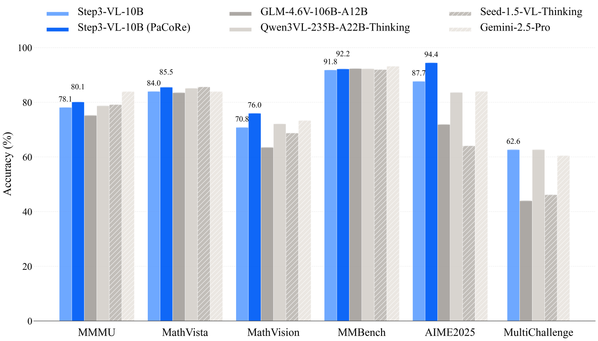

### 3.3 其他关键技术

-   神经音频合成:自研 MIDI-BRAVE(基于 BRAVE 流式架构;CLAP 512D → 256D z\_timbre 音色条件 + MIDI 32D z\_midi temporal FiLM 注入,BRAVE 因果解码器;四类独立模型共 200 音色,Phase 1 可训练参数 8.18M)
-   音色筛选与语义评估:CLAP 音频-文本对比表征
-   前端:浏览器 5×16 Sequence 交互、AudioWorklet 播放、WebSocket PCM 流、MediaStream 录制

## 四、作品演示与团队

-   演示视频: https://www.bilibili.com/video/BV1kggC6DExm/
-   开源仓库: https://github.com/Twiddle-AI-China/intelligent\_jungle
-   CSDN 博客: https://blog.csdn.net/weixin\_51543645/article/details/163107009?spm=1011.2415.3001.5331

###  团队:**<u>Twiddle AI</u>**

**Twiddle AI , 为 AI 音乐时代创造新的乐器和创作工作流。**

我们相信,AI 不应该只替人生成一首完成品,而应该成为人可以持续演奏、控制和共同创作的音乐系统。Twiddle AI 聚焦 AI 乐器、实时音乐交互与智能音频技术,通过硬件、软件和生成模型的结合,把语音、手势、演奏和音乐生成连接成一套可控、可编辑、可实时反馈的创作工作流。我们的产品既降低音乐创作与演奏的门槛,也为音乐人提供新的声音设计、灵感捕捉和人机协作方式,让 AI 从后台的生成工具,变成可以亲手参与、实时交流的乐器与创作伙伴。

**<u>团队成员（从左到右）:</u>**

**黄弈风**：MIDI-BRAVE架构设计、训练/推理 Infra调优

**胡佳弋**：数据准备、MIDI-BRAVE架构设计及训练

**史雨轩**：数据准备、MIDI-BRAVE实时推理系统架构

**章江南(队长)**：系统级赛题概念提出、前端声音及交互系统搭建

**肖玮圣**：数据准备、端侧模型选型

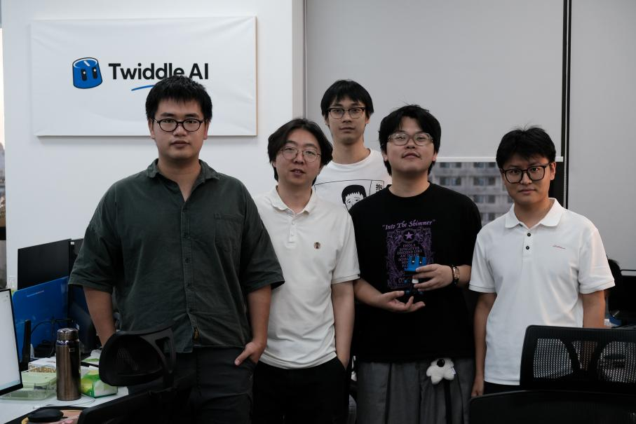

## 附录：后记

Twiddle AI作为一个新生的团队，这是我们第一次参加黑客松。从最初的想法构想到最终完成 Intelligent Jungle & MIDI-BRAVE 整套系统，这一路充满了挑战。我们经历了从算法设计、模型训练、系统架构搭建，到实时推理优化、交互设计与最终呈现的完整过程。很多问题在开始时都没有现成答案，需要团队不断尝试、验证、推翻，再重新构建。也正是在这样的过程中，我们对 AI 音频生成、智能体系统以及端到端产品落地有了更深入的理解。

非常感谢 NVIDIA 和活动主办方提供这样一个开放、高强度的创新平台，让我们有机会将一个大胆的想法真正推进到可运行的系统。同时也特别感谢 StepFun 在技术交流、模型能力支持以及创新探索上的帮助，让我们能够不断突破原有边界，尝试将大模型、神经音频与生态模拟结合起来。

这次黑客松对我们而言不仅是一次比赛，更像是一段快速成长的旅程。短短时间内，我们完成了许多过去没有接触过的技术挑战，也学会了如何在有限资源和时间约束下进行工程取舍、快速迭代，并将研究想法转化为实际作品。

当然，整个过程并不容易。从模型训练的不稳定，到实时性能优化中的瓶颈，再到系统各模块之间的协同，每一个阶段都遇到了困难。但正是这些挑战推动我们不断前进，也让最终实现的 Intelligent Jungle & MIDI-BRAVE 不只是一个概念验证，而成为了一套真正能够运行、能够交互、能够持续演化的系统。

感谢所有给予支持和帮助的人，也感谢一路坚持投入的团队成员。这次经历让我们更加坚定：AI 不仅可以生成内容，也可以成为创造新型交互、新型艺术表达和新型体验的伙伴。

未来，我们希望继续沿着这条方向探索，让 AI 与音乐、自然以及人的创造力产生更多可能。

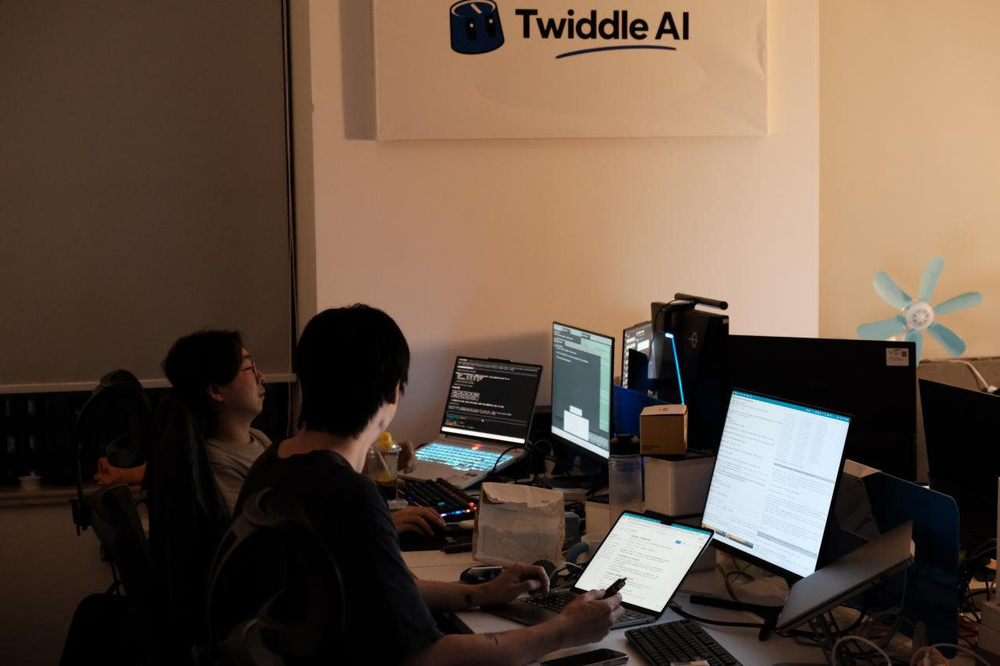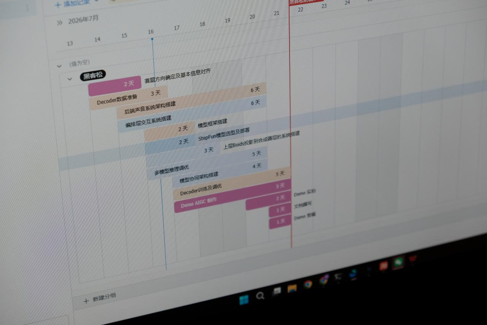
