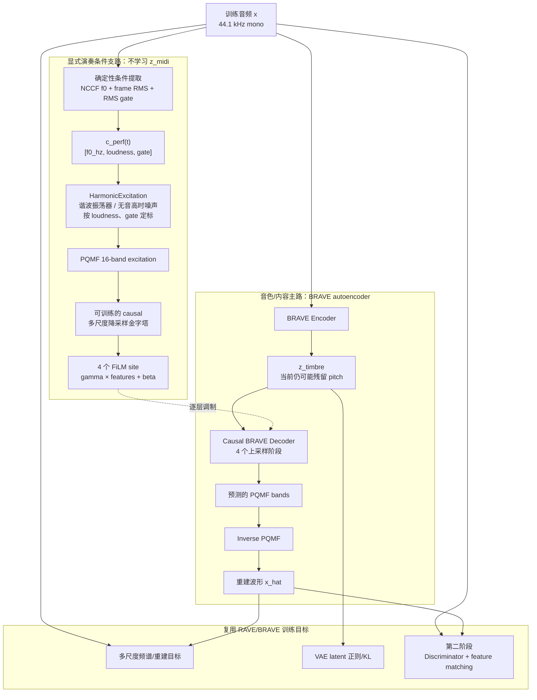
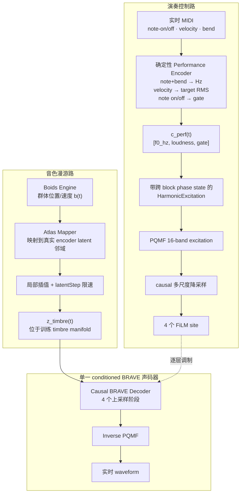

# 显式 MIDI/Pitch Conditioning 架构

## 一句话定义

当前方案不是训练一个不透明的 `z_midi`，而是把演奏意图固定为三个有物理意义、
可直接检查的逐帧控制量：

```text
c_perf(t) = [f0_hz(t), loudness(t), gate(t)]
```

- `f0_hz`：目标基频，包含连续 pitch bend；`0 Hz` 保留给无音高/噪声激励；
- `loudness`：目标 RMS，训练时从音频测量，演奏时由 velocity 映射；
- `gate`：发声包络开关，训练时由 RMS 阈值得到，演奏时来自 note-on/off。

`c_perf(t)` 不和 timbre latent 一起交给一个黑盒融合网络。它先被渲染成有明确音高
的谐波/噪声 excitation，再经 PQMF 分频和多尺度降采样，在 BRAVE decoder 的每个
上采样阶段通过 FiLM 调制特征。音色 latent 走原 BRAVE 主干，演奏条件走独立控制
支路。

## 训练架构（当前 P0-B 实现）



### 训练时到底在学什么

1. 同一段音频走两条路：encoder 提取 `z_timbre`；确定性分析器提取
   `[f0_hz, loudness, gate]`。
2. 显式条件生成一条带目标基频、目标响度和 gate 的 excitation。
3. excitation 被分成 16 个 PQMF 子带，并对齐到 decoder 的四个时间尺度。
4. 每个 FiLM site 从对应尺度的 excitation 产生 `gamma/beta`，调制该层声学特征。
5. decoder 同时依靠 `z_timbre` 的音色信息和显式条件的演奏信息重建原音频。

P0-B 没有新增 pitch classifier、pitch adversary 或 pitch-swap loss；它复用 upstream
RAVE/BRAVE 的重建、latent 正则与第二阶段 adversarial 训练逻辑。FiLM 初始为恒等
映射（`gamma=1, beta=0`），所以接入时从原 BRAVE 行为开始，而不是随机破坏 decoder。

> 这里的“显式”指条件的语义、生成方式和注入位置都是固定且可检查的；不等于
> `z_timbre` 已经自动完成音高解耦。后者需要 P0-C 的干预实验和 probe 证明。

## 推理/实际演奏架构



推理时没有音频 encoder，也没有音高检测器：

- MIDI 直接确定目标音高、力度和开关，因而不会产生一个含义不明的 `z_midi`；
- Boids 不应通过无约束网络随意生成 latent，而是在真实语料编码形成的 atlas 上选择、
  插值和限速，得到连续的 `z_timbre(t)`；
- decoder 是唯一的神经音频生成器，不需要在输出后再用 pitch shifter 才得到目标音高；
- streaming oscillator 保存 phase state，使连续 block 之间不发生振荡器相位重置。

## 当前导出模型的实际接口

受 RAVE TorchScript method 接口约束，导出的 `decode_conditioned` 接收一个堆叠张量：

```text
input = [z_timbre channels | f0_hz | loudness | gate]
shape = [batch, latent_size + 3, latent_frames]
```

这只是传输封装。模型入口随即执行：

```text
z = input[:, :latent_size]
c_perf = input[:, latent_size:latent_size+4]
```

随后 `z` 进入 decoder 主路，`c_perf` 进入 excitation/FiLM 支路。两者没有在入口
做 learned concat fusion。导出物还携带固定 schema：

```text
pitch-conditioning-v2:f0_hz,loudness,gate,periodicity
```

（2026-07-16 起为 v2：P0-C4B 为非谐波音色增加 periodicity 混合通道，
契约详见 pitch-conditioned-brave.md。）

## 与讨论图最本质的差别

| 讨论图 | 当前显式架构 |
|---|---|
| MIDI Encoder 学习 `z_midi` | 确定性转换出 `[f0_hz, loudness, gate]` |
| `z_midi` 与 `z_timbre` 拼接后统一融合 | timbre 主路和 performance 控制路分开 |
| 条件可能只在 decoder 入口出现一次 | excitation 在 decoder 四个尺度反复通过 FiLM 注入 |
| Boids 经任意 `G` 生成 `z_boids` | Boids 在真实 encoder atlas 上产生 `z_timbre(t)` |
| 结构上希望 latent 已解耦 | 明确把解耦作为需要实验验证的目标 |

## 当前成立与尚未成立的结论

当前 P0-B 要证明：

- 条件支路可以训练，梯度能进入 FiLM 与降采样金字塔；
- checkpoint 能完整保存/恢复；
- offline/streaming TorchScript 能接受上述显式条件；
- streaming phase 和 causal delay 契约成立。

当前 P0-B **还不能证明**：

- decoder 一定会服从 MIDI，而不是继续从 `z_timbre` 读取音高；
- 固定音色切换条件时音色完全不变；
- `z_timbre` 已不含可预测的 f0；
- 原生复音已经解决。

这些需要在 P0-C 加入固定 latent 的 pitch swap/intervention、输出 cents error、
latent pitch probe，必要时再加入 pitch adversarial disentanglement。
