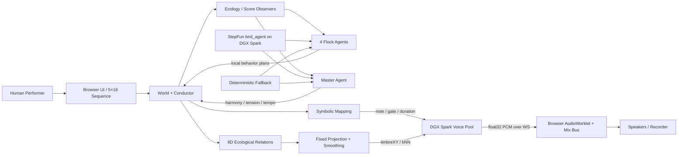

# Intelligent Jungle

> **The forest is the sequencer. The flock is the composer. The latent space is the instrument.**  
> 森林是音序器，鸟群是作曲家，潜空间是乐器。

## 1. Intelligent Jungle 从哪里来

### Jungle 的文化谱系：采样、切片与重组

1969 年，The Winstons 在《Amen, Brother》中留下了一段短鼓 solo；后来被称为 **Amen Break**。90 年代初，英国制作人把 funk break 切碎、重排、加速，并把它与 dub、reggae、sound-system 文化中的低频结合，形成 Jungle。它的关键精神从来不只是“高速鼓点”，而是从有限声音材料中，通过切片、错位与重组制造近乎无限的节奏生命。 Intelligent Jungle 延续的正是这种精神，把 Jungle 最核心的“切片—重排—反馈”机制，重构成一个**可持续运行的多智能体音乐生态**。

## 2. 核心亮点

### 亮点一：音乐不是被排列出来的，而是从生态系统中生长出来的

传统音序器把音乐理解为时间轴上的格子，Intelligent Jungle 把音乐理解为一个具有生命力的生态系统，让生态关系本身成为作曲机制：时间、季节、树、鸟群、能量、栖息、迁徙和群落关系持续变化，音乐是这些生命活动共同涌现的结果。

- 一天是一轮音乐生命循环，四季构成更长尺度的演化；
- 鸟落在哪条枝上，决定音高；何时栖落，决定起音；停留多久，决定时值；
- 不同物种拥有不同生存习性，因此自然形成 Pad、Melody、Bass、Jungle 四种音乐角色；
- 系统会记录上一轮生态状态，在下一轮延续、修正或变异，而不是每次从零生成。

音乐是一个会呼吸、会记忆、会变化的生命过程。


### 亮点二：多智能体协同的符号化音乐生成

Intelligent Jungle 由五个具有明确分工的音乐智能体共同运行：

- **Master Agent** 是全局环境与音乐结构的掌控者，管理时间、季节、天气、和弦进行、色彩、张力和速度；
- **Pad Flock Agent** 负责长驻、和声铺底与空间稳定；
- **Melody Flock Agent** 负责短驻、单音旋律、动机保持与小幅变奏；
- **Bass Flock Agent** 负责低频锚点、稀疏起音与结构稳定；
- **Jungle Flock Agent** 负责 break 的节奏密度、切片布局与句尾变化。

五个 Agent 在同一套**符号音乐世界**中协同：Master 提供共享的时间与和声环境，四个 Flock 在统一的空间上分别写入自己的音高、起音、时值和变体。每个 Agent 只拥有与自身角色相匹配的权限，因此局部具有个性，全局仍保持一致。这是一种新的符号音乐生成方式：作曲不再来自单一模型的一次输出，而来自多个智能体在共同世界状态下的持续决策、互相约束与共同演化。


### 亮点三：潜空间实时解码——一种新的乐器与发声机制

传统电子乐器的发声机制通常是振荡器、采样器或固定音色预设。Intelligent Jungle 使用自研预训练潜空间实时解码音频生成模型 MIDI-BRAVE，把“音色”从预先做好的声音，变成一个可以被生态状态连续驱动、实时生成的空间。

系统把发声拆成两个层次：

```text
符号音乐层
季节 / 和声 / 5×16 Sequence / 枝位 / gate
→ 决定何时发音、发什么音、持续多久

潜空间发声层
栖驻 / 能量 / 枝展开 / 驻留 / 换枝 / 邻群活动
→ 连续潜空间坐标 → 神经网络实时解码 → 音频波形
→ 决定这个声音此刻如何生长、如何变化
```

音符仍然具有清晰的音高和节奏结构，但每一次发声的音色都由当前生态状态塑形。鸟群关系变化，潜空间坐标随之移动，神经解码器逐块生成新的音频波形。声音不再只是触发一个 sample，也不只是改变滤波器参数，而是由模型在潜空间中实时合成。

因此 Intelligent Jungle 不只是一个 AI 作曲系统，也是一个新的数字乐器：生态系统是它的演奏界面，潜空间是它的共鸣体，实时神经解码模型是它的发声器官。

### 亮点四：人进入生态、影响生态

Intelligent Jungle 重新定义了人和生成系统的关系。人不是在开头输入 Prompt、在结尾挑选结果，也不是始终控制所有参数。系统本身能够自主运行，人可以在任何时刻进入其中，对一个局部施加影响，再把控制权交还给生态。

- 人可以观察音乐生命如何自行演化；
- 可以进入任一声部，在 5×16 符号空间中放置、移动或赶走鸟；
- 接管一个声部时，其余三个 Flock 与 Master 仍然自主运行；
- 人的行为会成为系统下一轮感知和决策的一部分；
- 交还控制权后，Agent 从被改变后的状态继续生长，而不是恢复到人介入之前。

这里的人机关系是人和一个具有自主性的音乐生命系统彼此影响。人既是观察者，也是环境变量和临时参与者；AI 不是等待指令的工具，而是拥有自身时间、记忆和行为的对象。

### 亮点五：DGX Spark × StepFun 端侧部署——完整系统不依赖云端算力

Intelligent Jungle 的多智能体决策和潜空间实时音频解码全部部署在 DGX Spark 端侧：StepFun 模型负责 Master 与四个 Flock 的智能决策，完全由 DGX Spark 预训练及提供实时推理服务的多音色神经解码模型 MIDI-Brave 负责实时生成声音，浏览器只承担交互、可视化和最终混音。

DGX Spark 的 GB10 Grace Blackwell Superchip、128 GB 统一内存和 NVIDIA AI 软件栈，使语言模型推理与多路神经音频解码能够在同一台桌面设备上持续运行。NVIDIA 官方规格提供最高 1 PFLOP FP4 AI 算力与 128 GB coherent unified memory。StepFun 模型通过 vLLM 以 OpenAI-compatible 服务部署在 Spark 本地，并针对音乐智能体的短输出、强约束任务进行适配：

- 四个 Flock 合并为一次推理请求，Master 与 Flock 决策并行；
- 使用 `json_schema` 将输出限制为可执行的音乐决策；
- 阈值与边界由本地程序预计算，模型专注于意图与策略；
- 7 行固定神经 Voice 池在 Spark 上持续进行流式音频解码；
- 决策、音频生成和交互均在局域端完成，不调用云端模型或云端 GPU。

这使 Intelligent Jungle 可以作为一个真正独立的端侧智能乐器运行：没有公网延迟，没有云端算力依赖，数据、模型、决策和声音都留在现场。


## 3. 功能演示

### 0:00–0:25｜进入一个有生命的音乐系统

操作：停在进入页，点击“进入”。

讲述：

> 这不是一个等待播放的音序器。进入之后，时间、季节、四个鸟群和五个 Agent 同时开始运行。音乐不是预先排好的结果，而是这个生态系统此刻的生命活动。

屏幕证据：`INTELLIGENT JUNGLE`、植物季节背景、单一进入按钮、音频启用后世界出现。

### 0:25–1:10｜观察音乐如何从生态中生长

操作：保持“全树”视图，先不触碰 1–2 个循环；打开“信息”。

讲述：

> 每个昼夜是一轮音乐生命循环。鸟的栖落形成音符，驻留形成时值，物种习性形成声部性格。右侧显示的不是预先写好的播放列表，而是森林根据上一轮状态作出的下一轮变化。

屏幕证据：四轨响度、生态与生存结算、林群回应中 master 与四声部的下一日意图。

### 1:10–1:55｜展示多智能体符号音乐协同

操作：依次点击左侧 `Pad → Melody → Bass → Texture`，每个停留约 8 秒。

讲述：

> Master 负责整个世界的时间、季节与和声，四个 Flock Agent 在同一套 5×16 符号网格中分别写自己的声部。它们共享环境，但拥有不同的行为权限和音乐性格。

- Pad / 斑鸠：长驻、低变化，形成和声地基；
- Melody / 百灵：单音优先、短驻、邻枝移动，形成可记忆旋律；
- Bass / 鹈鹕：低枝锚定、稀疏起音，稳定大结构；
- Jungle / 啄木鸟：真实 Amen slice 双速运行，在句尾做有证据的 break edit。

屏幕证据：播放头沿 5×16 枝群移动；不同声部的响度、年轮和树种身份同步切换。

### 1:55–2:45｜展示人如何进入并改变生态

操作：回到 Melody，点击“接管此声部”；点击 Sequence 节点放鸟，用 `A/S/D/F/G` 触发五条音高枝，再移走 1–2 个节点。

讲述：

> 我不是向 AI 重新下一个 Prompt，而是进入它正在运行的世界，只改变旋律这一部分。其他三个 Flock 和 Master 继续生活。我的动作会留在生态状态中，交还以后，Agent 将从我改变过的世界继续演化。

屏幕证据：状态从“自主演化”变为“用户接管”；网格立即变化并发声；其他轨保持运行。

### 2:45–3:35｜展示新的潜空间发声机制

操作：在神经声源 ready 时打开“潜空间漫游器”；先展示安全 XY/kNN 模式，再轻微移动；随后交还林群。

讲述：

> 传统音序器走到一个格子，通常触发一个预先存在的声音。这里的 Sequence 只决定音符结构；真正的声音由生态状态推动潜空间，再由神经网络逐块实时解码出来。我们不是在切换音色预设，而是在演奏一种新的发声模型。

屏幕证据：潜空间入口由“连接中”变为可用；拖动时声音连续变化；交还后继续自动漫游。

若神经声源未 ready：跳过此操作，不演示潜空间实时解码。

### 3:35–4:05｜展示 DGX Spark 与 StepFun 端侧运行

操作：指出“林群回应”中的 Master 与四个 Flock 决策；展示本地服务状态或准备好的 Spark 监控画面。

讲述：

> 现在看到的五个 Agent 决策，以及正在听到的神经音频，都在这台 DGX Spark 上本地运行。StepFun 负责智能体决策，实时解码模型负责声音生成。整个作品不请求云端模型，也不依赖云端 GPU。

### 4:05–4:30｜收束：五个核心亮点

操作：点击“录制”，演奏一小段后停止；回到全树。

讲述：

> Intelligent Jungle 是一个有生命力的音乐生态；它由多智能体共同进行符号化作曲；通过潜空间实时解码形成新的乐器和发声机制；人可以进入其中并改变它的未来；而这一切都在 DGX Spark 与 StepFun 的端侧系统中完成，不依赖云端算力。

## 4. 评委可能追问的问题

### “这不就是把音序器画成了一棵树吗？”

不是。树和鸟不是皮肤，而是系统状态与音乐参数的因果来源：栖落决定起音，枝位决定音高，驻留决定时值，物种习性决定声部行为，日结观测决定下一轮变异。没有生态运行，就没有这段音乐。

### “为什么要用多个 Agent，而不是一次生成整首音乐？”

因为四个声部拥有不同职责和时间尺度。Master 维护共享的世界与音乐结构，四个 Flock 分别生成局部符号行为。分权让声部保留独立性，又能在同一和声、节拍和生态状态下互相约束。

### “潜空间模型和普通合成器或采样器有什么本质区别？”

普通采样器回放已有波形，普通合成器按固定算法产生波形；本系统根据实时变化的潜空间条件，通过神经解码模型逐块生成音频。生态关系可以连续改变发声结果，因此潜空间与 decoder 共同构成了一种新的数字乐器结构。

### “人到底在系统里做什么？”

人不需要先描述一首歌，也不必全程控制所有参数。人可以观察自主生态，局部接管一个声部，改变符号状态，再将控制权交还。系统会从改变后的状态继续运行，因此人的作用是进入并影响音乐生命，而不是发出一次生成命令。

### “是否仍然依赖云端模型或云端 GPU？”

不依赖。StepFun 智能体推理与多音色潜空间实时解码都运行在 DGX Spark 本地，浏览器通过局域端服务完成交互和音频播放。正式部署的完整数据链和生成链不需要公网云端算力。

## 5. 技术实现（技术团队补完区）

> 建议篇幅：2–3 页。此处只给已经过仓库核实的事实骨架，技术团队补最终接口图、部署版本和性能截图。

### 5.1 符号音乐层

- 统一地址：`{treeId, pitchBranchId, stepIndex}`；四声部均为 5 条音高枝 × 16 步。
- 1 天 = 4 小节 × 4 拍；Jungle 走双倍播放头。
- Master 只从季节和声菜单选 progression / color / tension / tempo intent。
- Flock 输出 `dwellBeats / activeBars / holdLoops / cellMutations`，cell mutation 必须从昨日占用格原子移动到同网格空格。
- economy 使用按声部启用的八指标框架；和谐分 H 独立观测，不直接乘总分。

建议补充：Sequence 数据结构图、一次 dayReview 的请求/响应样例、四声部偏好表。

### 5.2 多智能体推理层

- Spark 服务：vLLM 0.25.1 + Step3-VL-10B INT4 AWQ-CT，OpenAI-compatible，服务名 `bird_agent`。
- 四 flock 单请求批处理；flock / master 用 `Promise.all` 并行。
- `json_schema` 约束结构，代码侧执行菜单校验、clamp、非法整包回退。
- 调度器包含 single-flight、按日退避、连续失败断路器；响应错过黎明则延后，不打断 transport。
- 规则层与 LLM 使用同一输入投影、同一安全菜单和同一应用接口。

建议补充：StepFun Prompt Lab 对照实验截图、8/8 结构/语义回归结果、生产服务监控截图。

### 5.3 神经音频层

- Spark `brave-voices` 后端固定 7 行：bass ×1、lead/melody ×1、pluck ×1、pad ×4；pad 四行共享模型权重但保持独立 streaming state，可产生真实四音和弦。
- bass / lead / pluck 使用 MidiBrave v2 256D `z_timbre`；pad 使用 TrajectoryBrave 8D 控制 → 128D 声学轨迹 → BRAVE decoder。
- 每个声部拥有自己的训练 anchor 地图；自动路径仅用 XY + kNN=4，在真实训练点凸包内混合。
- 浏览器通过 WebSocket 接收 float32 PCM，AudioWorklet 播放；EQ、FX、混响、昼夜宏保留在浏览器总线。
- texture/Jungle 当前使用真实 Amen sample 的浏览器颗粒切片，不伪装成尚未训练好的神经打击模型。

建议补充：checkpoint 清单与 hash、PCM block 时序、端到端首包延迟与抖动数据。

## 6. 架构设计（技术团队补完区）




设计原则：

1. **音乐泄漏隔离**：Flock 只读无 MIDI 的生态投影，和声权收敛到 Master。
2. **结构与音色解耦**：符号链控制 note/gate，连续链控制 timbre；两条链只在 voice engine 汇合。
3. **事件驱动**：`perch / unperch / dawn / dusk` 是系统事实，音频、渲染、评分是订阅者。
4. **固定 Voice 池**：避免动态 batch 改变导致跨块状态清零和所有声部爆音。
5. **逐层回退**：StepFun → 规则；神经音源 → 本地音源；任一外部失败都不停止 transport。

技术团队待补：部署拓扑（浏览器、8081、8090/8443）、端口与 TLS、进程/容器关系、数据和控制平面分色图。

## 7. 相关优化（技术团队补完区）

### 7.1 DGX Spark / 神经解码优化

已核实数据：

- 四行 GPU render p50 / p95：**17.8 / 22.3 ms**；音频块预算 46.44 ms。
- 七行满载串行 p50 / p95：**36.78 / 37.49 ms**。
- 持久 CUDA stream 跨行并行后 p50 / p95：**30.16 / 33.83 ms**，约保留 27% 块预算余量。
- pad 四行共享同一只读模型实例，只保留独立 streaming state，避免重复权重占用。
- 固定 7 行池、未发声行 `gate=0` 常驻，避免重建 batch 和 decoder state。
- 每个音色只在自己的训练 anchor 地图内 kNN 混合；自动控制限制在中央安全 extent。

待补：统一内存占用、模型冷启动、WS 首包、AudioWorklet jitter buffer、多人共享 GPU 下的 p95/p99。

### 7.2 StepFun 推理优化

已核实数据：

- 单流约 40 tok/s，TTFT 50–110 ms；16 并发聚合约 637 tok/s。
- 约 1300 token 输入 / 90 token 输出的 JSON 决策，实测 2.2–3.0 秒。
- 服务端前缀缓存约 50% 命中；长 system prompt 可复用。
- `json_schema` 替代 `json_object`，避免大 JSON 输入被模型原样复读。
- 布尔 flags 替代模型数值比较；短 `reason` + 后置枚举改善稳定性。
- 投机解码虽曾将单请求缩短到约 1.0–1.5 秒，但与结构化输出组合出现确定性空白循环，因此生产主动不启用——优先正确性与稳定性。

待补：最新生产模型版本、真实 30 分钟成功率、P50/P95、结构校验失败率、fallback 命中率。

### 7.3 前端实时性与可靠性

- 生产页不保存或透传第三方 API Key，只注入 Spark 服务地址。
- StepFun 启动健康检查上限 1.5 秒，不可达时静默运行规则层。
- 神经音频在局域网裸 IP 下必须使用 HTTPS，或经 SSH 隧道以 localhost 打开，保证 AudioWorklet secure context。
- 客户端连接超时需覆盖 7 行 backend 初始化与增益标定；当前分支正从 6 秒调整为 25 秒。
- 录制来自最终 MediaStream，能捕获实际听到的混音，不依赖符号地址。

## 8. 演示准备与事实边界（内部，不投屏）

### 当前已验证

- `npm run test:mvp`：**376 / 376 通过**（2026-07-22 本机实跑）。
- 本地真实浏览器：进入页、四声部定位、生态结算、林群回应、USER 接管入口和录制入口正常。
- 当前局域网 StepFun 可达；真实页面已收到 Master + 四个 Flock 的 LLM 决策。
- `brave-voices` 后端、生态→latent 自动漫游、USER 暂停/恢复与性能脚本均已有实现和测试。

### 演示前必须复查

1. **神经客户端静态路径**：本机 `4193/mvp/` 当前请求 `/_client/voice-client.js` 返回 404，因此自动回落本地合成；正式演示应从 flock-voice-engine 同源入口打开，或修正静态资源路由。
2. **secure context**：裸 `http://192.168.9.140` 无法使用 AudioWorklet；使用可信 HTTPS 或 localhost 隧道。
3. **握手窗口**：7 行后端初始化可能超过旧 6 秒阈值；确认 25 秒连接窗口改动已部署并出现 ready。
4. **Amen 资产**：确认 `cw_amen_jungle.wav` 200 且浏览器无加载错误。
5. **声音口径**：只有看到神经后端 ready 才演示“潜空间实时解码”；否则明确称为 Web Audio 安全回退。

### 仓库事实源

- 当前产品与运行：[mvp/README.md](../mvp/README.md)
- Agent / 计分事实：[music-agent-scoring-facts-2026-07-21.md](music-agent-scoring-facts-2026-07-21.md)
- 生态潜空间映射：[ecological-latent-control.md](ecological-latent-control.md)
- 神经音频后端：[flock-voice-engine/README.md](../flock-voice-engine/README.md)
- StepFun / 8081 优化：[handoff-8081-8086.md](handoff-8081-8086.md)

