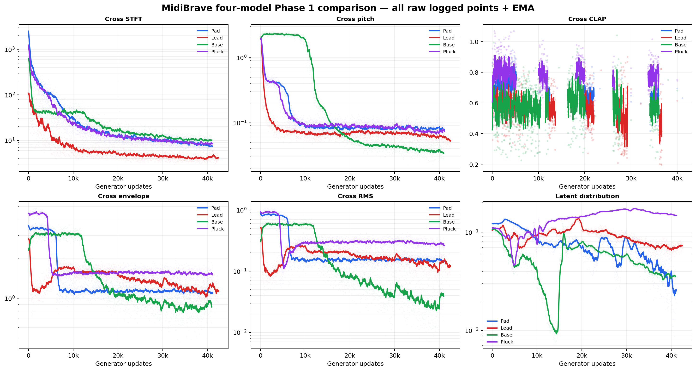
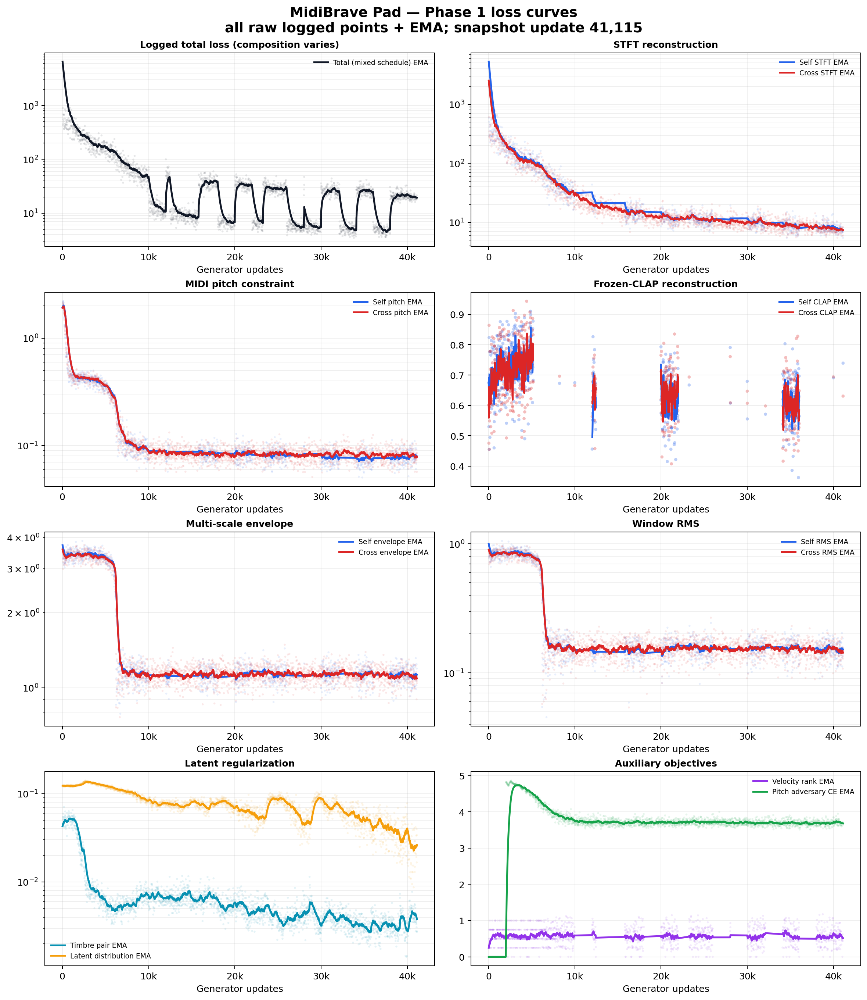
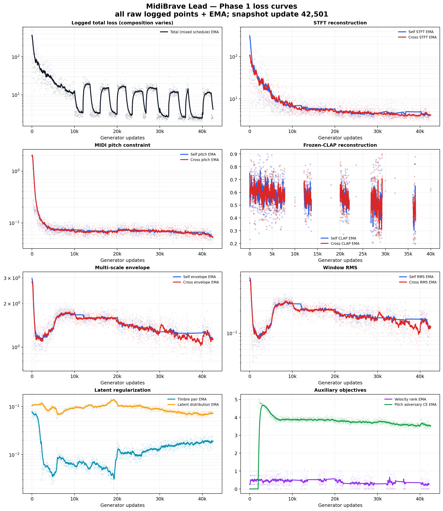
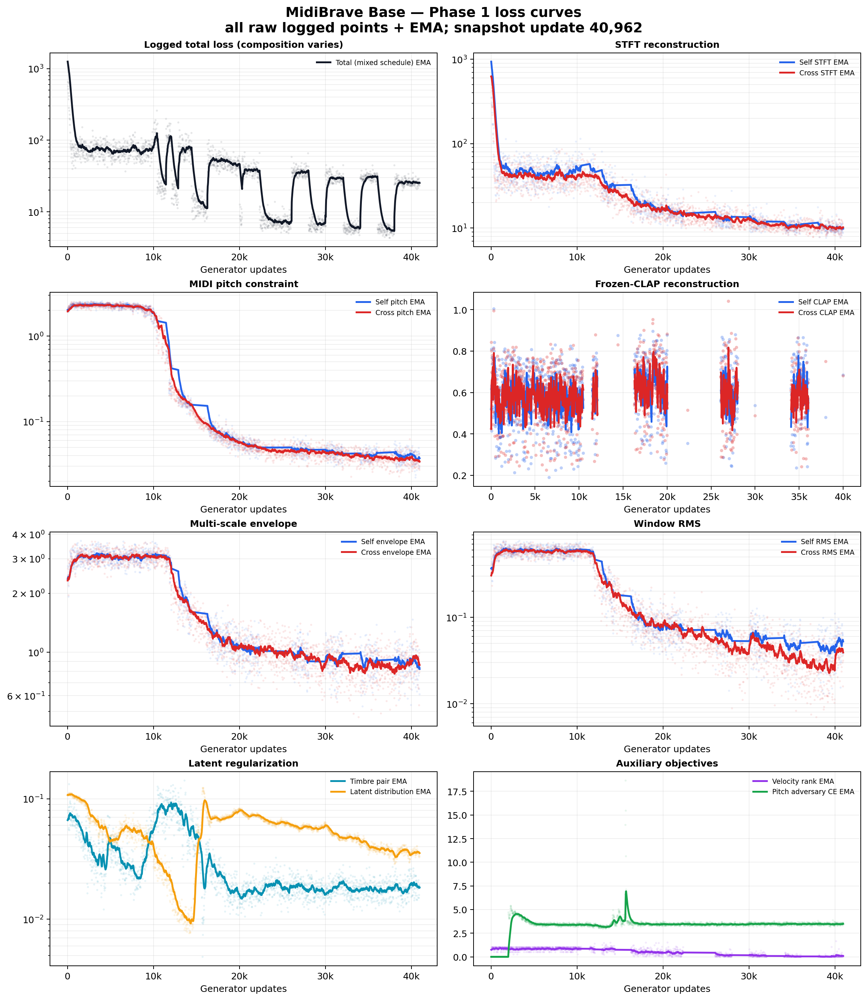
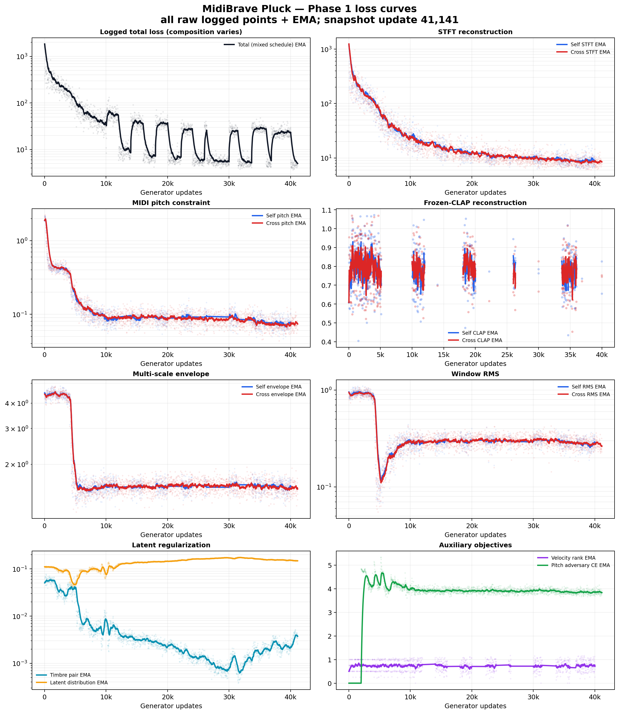

# MidiBrave 四模型训练状态与 Loss 曲线报告

> 统计截点：2026-07-20 16:20 CST  
> 正式训练启动：2026-07-20 09:03:43 CST  
> 本报告对象：Pad、Lead、Base、Pluck 四个已运行模型；Texture 尚在等待 GPU 资源  
> 曲线来源：Octopus `/data/midibrave-v2/runs/*_clap_recon_top50_100k_safe_fallback/phase1/metrics.jsonl`

## 1. 结论摘要

四个模型已训练约 **7 小时 16 分钟**，都已越过 40k updates，并保存了 40k 永久 Checkpoint。训练未发生持续 NaN、OOM 或模型发散。

当前可以得出以下结论：

1. **MIDI 音高约束已学会**：四模型的 Cross pitch loss 均已降到约 `0.04–0.08`，Base 虽然前 10k 几乎不收敛，但 10k–20k 出现了明显的延迟解锁。
2. **波形频谱重建正常收敛**：Lead 最好，Cross STFT 约 `4.04`；Pad/Pluck 约 `8.7`；Base 约 `10.5`。四模型 STFT 仍在下降，尚不建议统一早停。
3. **CLAP 是当前最不确定的目标**：Lead 的 30k–40k 区间改善最明显，Pad 只有缓慢改善，Base 和 Pluck 暂时没有形成可信的单调下降。CLAP 每 4 updates 才计算一次、且只选 1 个样本，训练日志又每 20 loops 记录，因此曲线天然稀疏且方差较大，最终必须依靠固定验证集离线评估。
4. **Pluck 存在 latent 分布风险**：`timbre_pair` 明显改善，但 `distribution` 从约 `0.11` 升到 `0.15–0.16`，说明样本成对一致性在提升，但整体 latent 展开约束在变差。
5. **AMP 数值状态可控**：Pad/Lead/Base/Pluck 分别有 `19/19/18/19` 次 skipped update，约占 `0.044%–0.046%`，都在下一步恢复，并未形成连续非有限梯度。
6. **当前还是 Phase 1**：判别器、GAN generator loss 和 feature matching 尚未参与当前曲线；这些是 Phase 2 目标，应在 Phase 1 Checkpoint 完成听感与定量评估后再启动。

## 2. 当前训练进度

| 模型 | 最新 update | 相对 100k | 最新永久 Checkpoint | skipped updates | 当前状态 |
|---|---:|---:|---:|---:|---|
| Pad | 41,115 | 41.1% | 40k | 19 | 40k→50k 正在运行 |
| Lead | 42,501 | 42.5% | 40k | 19 | 40k→50k 正在运行 |
| Base | 40,962 | 41.0% | 40k | 18 | 40k→50k 正在运行 |
| Pluck | 41,141 | 41.1% | 40k | 19 | 40k→50k 正在运行 |
| Texture | 0 | 0% | 无 | 0 | Job 1086 等待 Resources |

### 2.1 实际训练配置

| 项目 | 当前值 |
|---|---|
| 采样率 | 44,100 Hz |
| 训练窗口 | 49,152 samples，约 1.115 s |
| 最小有效音频 | 16,384 samples，约 0.372 s |
| onset crop 概率 | 0.5 |
| 音色条件 | 冻结 CLAP 完整渲染 embedding，512D 输入 |
| `z_timbre` | 256D |
| `z_midi` | 32D |
| Decoder capacity | 64 |
| PQMF | 16 bands，256 taps |
| 单 GPU batch | 10 pairs |
| GPU | 每模型 2×V100 16GB |
| 梯度累积 | 4 |
| Global batch | `10 × 2 GPU × 4 = 80` 对样本/update |
| 精度 | AMP FP16；STFT、CREPE、PQMF tail、norm reduction 和 phase accumulation 保留 FP32 |
| Phase 1 目标 | 100,000 updates |
| 永久 Checkpoint | 1k，之后每 10k，直至 100k |
| 滚动断点 | 每 1k updates |

Self 分支在前 10k updates 每步计算；10k 之后每步以 `p=0.5` 采样，被选中时乘以 `1/p=2`，使梯度期望不变。Cross 分支每步保留。

## 3. 符号和双分支训练任务

对同一 preset 的两个渲染样本：

- `x_A, m_A`：来源音频及其 MIDI note/velocity。
- `x_B, m_B`：目标音频及另一组 MIDI note/velocity。
- `z_A = E_timbre(CLAP(x_A))`：256D 音色 latent。
- `x̂_self = D(z_A, C_midi(m_A))`：自身 MIDI 重建自身音频。
- `x̂_cross = D(z_A, C_midi(m_B))`：保留 A 的音色，用 B 的 MIDI 重建 `x_B`。

Self 和 Cross 共享同一个 Decoder，区别仅在于 MIDI 条件和目标音频。

## 4. 当前 Loss 的具体公式

### 4.1 多分辨率 STFT 重建

对 FFT 尺度 `N ∈ {2048, 1024, 512, 256, 128}`，记：

$$
M_N(x)=\max\left(|\operatorname{STFT}_N(x)|,10^{-7}\right)
$$

$$
L_{sc}^{(N)}=
\frac{\|M_N(\hat{x})-M_N(x)\|_F}
{\|M_N(x)\|_F+\epsilon}
$$

$$
L_{log}^{(N)}=
\operatorname{mean}\left(
|\log M_N(\hat{x})-\log M_N(x)|
\right)
$$

$$
L_{MRSTFT}=\frac{1}{5}\sum_N
\left(L_{sc}^{(N)}+L_{log}^{(N)}\right)
$$

同时对 16-band PQMF 子带计算 FFT `1024/512/256/128` 的同类损失：

$$
L_{STFT}=L_{MRSTFT}+0.25L_{MBSTFT}
$$

它是当前波形重建的主要损失，同时约束频谱幅度、谐波、宽带噪声与 PQMF 子带结构。

### 4.2 多尺度包络 Loss

对 `w ∈ {1024, 4096, 16384}`，hop 为 `w/4`：

$$
E_w(x)=\sqrt{\operatorname{AvgPool}_w(x^2)+10^{-8}}
$$

$$
L_{env}^{(w)}=
\|\log E_w(\hat{x})-\log E_w(x)\|_1
+0.5\|\Delta\log E_w(\hat{x})-\Delta\log E_w(x)\|_1
$$

$$
L_{env}=\frac{1}{3}\sum_wL_{env}^{(w)}
$$

第一项约束幅度包络，第二项约束包络变化速度，用于改善 attack、release 和慢速起伏。

### 4.3 RMS 音量 Loss

$$
r(x)=20\log_{10}\left(\sqrt{\operatorname{mean}(x^2)+10^{-8}}+10^{-7}\right)
$$

$$
L_{rms}=\operatorname{SmoothL1}\left(
\frac{r(\hat{x})-r(x)}{20},0
\right)
$$

它约束音量和能量尺度，不直接约束每个 waveform sample。

### 4.4 MIDI Pitch Loss

#### 每步执行的解析音高项

对目标 MIDI note `n`，候选为：

$$
\mathcal{N}=\{n,n-1,n+1,n-12,n+12\}
$$

对每个候选基频取 1–8 次谐波，按 `1/h` 加权其 log magnitude，得到 harmonic-comb score `s_j`。目标类是候选集中的原始 note：

$$
L_{comb}=\operatorname{CE}(4s,0)
$$

对目标 MIDI 基频 `f_n`，令 `\tau=round(f_s/f_n)`：

$$
\rho_\tau(x)=
\frac{\langle x_t,x_{t+\tau}\rangle}
{\|x_t\|_2\|x_{t+\tau}\|_2+\epsilon}
$$

$$
L_{pitch,analytic}=L_{comb}+0.25\max(0,0.3-\rho_\tau)
$$

损失只在 pitch cache 有效且置信度足够的帧上计算。

#### 前 5k 的 Safe CREPE 辅助项

$$
L_{CREPE}=
L_{cents}
+0\cdot L_{KL}
+1.0L_{activation}
+0.25L_{hardneg}
+20L_{autocorr}
$$

其中：

- `L_cents`：期望 cents 与目标 cents 之差除以 100 后的 SmoothL1。
- `L_activation`：目标音高 bin 的 BCE-with-logits 激活约束。
- `L_hardneg`：压制距目标超过 100 cents 的最强错误音高。
- `L_autocorr`：只惩罚生成音频相比真实音频缺少的目标周期性。

CREPE 在 0–1k 每 2 updates 执行，1k–5k 每 4 updates 执行，5k 后完全停止。CREPE 波形梯度经过隔离、`nan_to_num` 和 norm 1.0 裁剪，不会把冻结 CREPE 内部异常直接传回 Decoder。

日志中的 `self_pitch/cross_pitch` 为：

$$
L_{pitch}=L_{pitch,analytic}+
\mathbb{1}_{CREPE\ due}L_{CREPE}
$$

因此 5k 前后的 pitch 数值不是完全同构的指标，应主要观察 5k 后的解析音高曲线。

### 4.5 CLAP 重建 Loss

这里的 CLAP 损失不是对输入 conditioning cache 做距离，而是对当次实际训练窗口的生成音频和目标音频重新编码：

$$
e_{gen}=\operatorname{norm}(CLAP(\hat{x})),\qquad
e_{target}=\operatorname{norm}(CLAP(x))
$$

$$
L_{CLAP}=\max\left(0,1-\cos(e_{gen},e_{target})\right)
$$

CLAP 参数冻结，但允许梯度经由 waveform 传回 Decoder。波形梯度 norm 上限为 1.0。

当前 Self/Cross 权重均为 `2.0`，前 1k 线性 warmup：

$$
w_{CLAP}(u)=2\min\left(1,\frac{u+1}{1000}\right)
$$

实际每 4 updates 、每次仅 1 个样本计算，实现中对梯度乘以稀疏采样校正，使其期望等价于每步计算。

### 4.6 Velocity ranking

令完整 render 的真实 RMS 差为：

$$
\Delta r_{target}=r(x_B)-r(x_A)
$$

生成分支 RMS 差为：

$$
\Delta r_{pred}=r(\hat{x}_{cross})-r(\hat{x}_{self})
$$

仅当以下条件全部成立时激活：

$$
n_A=n_B,\quad v_A\ne v_B,\quad
|\Delta r_{target}|\ge m,\quad \Delta r_{target}\ne0
$$

$$
L_{vel-rank}=\max\left(
0,m-\operatorname{sign}(\Delta r_{target})\Delta r_{pred}
\right),\qquad m=1\ \mathrm{dB}
$$

如果没有激活样本，返回 0。因此 `v_A=v_B` 时不会再出现无条件的 margin loss。

`velocity_delta` 的实现为：

$$
L_{vel-delta}=\operatorname{SmoothL1}
\left(\frac{\Delta r_{pred}}{6},
\frac{\Delta r_{target}}{6}\right)
$$

但当前权重为 **0**，不影响训练。`velocity_rank` 权重为 0.05，只作为弱辅助约束。

### 4.7 Timbre pair 一致性

对同 preset 的两个渲染：

$$
L_{timbre}=1-\cos(z_A,z_B)
$$

目标是使音色 latent 尽量对 MIDI note/velocity 不敏感。

### 4.8 Latent distribution

合并 batch 中的 `z_A,z_B`，记第 `d` 维标准差为 `\sigma_d`，协方差矩阵为 `C`：

$$
L_{std}=\frac{1}{D}\sum_d\max(0,0.2-\sigma_d)
$$

$$
L_{cov}=\frac{1}{D(D-1)}\sum_{i\ne j}C_{ij}^2
$$

$$
L_{dist}=L_{std}+L_{cov}
$$

目标是防止 latent collapse，并减少维度之间的线性冗余。当前使用全局 moments 后端，统计量固定为 FP32。

### 4.9 Pitch adversary

Pitch classifier 从 `z_timbre` 预测 MIDI note：

$$
L_{pitch-adv}=\operatorname{CE}(P(GRL(z_A)),n_A)
$$

GRL 对分类器传递正常梯度，对 timbre encoder 传递反向梯度。它在 2k 启动，用 400 updates 从 0 增加到 1。

需要注意：日志中的 raw CE 下降代表分类器变强，不能像普通重建 loss 一样解读为「对 timbre encoder 一定更好」。

### 4.10 当前 Phase 1 总 Loss

记 `s_self=1` 为前 10k 全量 Self；10k 后被采样的 Self 步为 `s_self=2`，未采样步不存在 Self 项。忽略稀疏计算的实现细节，当前目标的期望形式为：

$$
\begin{aligned}
L_{P1}={}&s_{self}\left(
1.0L_{self,STFT}+0.05L_{self,env}
+0.5L_{self,pitch}+0.25L_{self,rms}
+2.0L_{self,CLAP}
\right)\\
&+0.5L_{cross,STFT}+0.0125L_{cross,env}
+1.0L_{cross,pitch}+0.5L_{cross,rms}
+2.0L_{cross,CLAP}\\
&+0.05s_{self}L_{vel-rank}
+0.1L_{timbre}+0.01L_{dist}
+0.1L_{pitch-adv}
\end{aligned}
$$

#### 每个子 Loss 的权重和调度

| 日志字段 / Loss | 配置权重 | 额外缩放或调度 | 当前 Phase 1 |
|---|---:|---|---|
| `self_stft` | 1.0 | 乘 `s_self` | 启用 |
| `self_envelope` | 0.05 | 乘 `s_self` | 启用 |
| `self_pitch` | 0.5 | 乘 `s_self`；CREPE 仅在前 5k 的指定步骤加入 raw pitch | 启用 |
| `self_rms` | 0.25 | 乘 `s_self` | 启用 |
| `self_spectral_flux` | 0.0 | 乘 `s_self` | 禁用 |
| `self_band_statistics` | 0.0 | 乘 `s_self` | 禁用 |
| `self_clap` | 2.0 | 乘 `s_self`；前 1k 线性 warmup；每 4 updates 抽样一次 | 启用 |
| `cross_stft` | 0.5 | 每步执行 | 启用 |
| `cross_envelope` | 0.0125 | 每步执行 | 启用 |
| `cross_pitch` | 1.0 | CREPE 仅在前 5k 的指定步骤加入 raw pitch | 启用 |
| `cross_rms` | 0.5 | 每步执行 | 启用 |
| `cross_spectral_flux` | 0.0 | 无 | 禁用 |
| `cross_band_statistics` | 0.0 | 无 | 禁用 |
| `cross_clap` | 2.0 | 前 1k 线性 warmup；每 4 updates 抽样一次 | 启用 |
| `velocity_rank` | 0.05 | 只在 Self 存在时计算，乘 `s_self` | 启用，弱约束 |
| `velocity_delta` | 0.0 | 只在 Self 存在时可计算 | 禁用 |
| `timbre_pair` | 0.1 | 每步执行 | 启用 |
| `distribution` | 0.01 | 每步执行，FP32 global moments | 启用 |
| `pitch_adversary` | 0.1 | 2k 启动，GRL 对 encoder 在 400 updates 内从 0 ramp 到 1 | 启用 |
| `adversarial` | 0.1 | 只有 Phase 2 构建判别器后才存在 | Phase 1 未启用 |
| `feature_matching` | 1.0 | 只有 Phase 2 构建判别器后才存在 | Phase 1 未启用 |

Self 动态缩放为：

$$
s_{self}(u)=
\begin{cases}
1, & u<10000\\
2, & u\ge10000\ \text{且本步选中 Self}\\
0, & u\ge10000\ \text{且本步未选中 Self}
\end{cases}
$$

10k 之后 Self 的选中概率为 0.5，因此：

$$
\mathbb{E}[s_{self}]=0.5\times2+0.5\times0=1
$$

即减少了计算量，但不改变 Self 目标在梯度期望中的总权重。

#### raw loss、`weighted_*` 与 `total` 的关系

日志中不带 `weighted_` 前缀的字段是未加权 raw loss。对普通重建项：

$$
\operatorname{weighted}_i(u)=
L_i(u)\times w_i\times q_i(u)
$$

其中 `w_i` 是上表的配置权重，`q_i=s_self` 适用于 Self 和 velocity 项，其他项 `q_i=1`。

对不执行 CLAP 的当前 Phase 1 update：

$$
L_{total,logged}(u)=\sum_{i\in\mathcal{A}(u)}
\operatorname{weighted}_i(u)
$$

`\mathcal{A}(u)` 是本 update 实际执行的子项集合，因此未选中 Self 的步骤不包含任何 Self/velocity 项。

如果本步需要 CLAP，日志中的 Total 再加上普通尺度的 CLAP 数值：

$$
\begin{aligned}
L_{total,logged}(u)={}&
L_{rec,logged}(u)\\
&+s_{self}(u)w_{CLAP}(u)L_{self,CLAP}(u)\\
&+w_{CLAP}(u)L_{cross,CLAP}(u)
\end{aligned}
$$

但 CLAP 只每 `K=4` updates 计算一次。为使稀疏估计的梯度期望等价于每步计算，对 CLAP update 实际注入 Decoder 的波形梯度乘以 `K=4`：

$$
\nabla_\theta L_{CLAP,sparse}(u)
=K\,w_{CLAP}(u)q_i(u)
\frac{\partial L_{CLAP}}{\partial\hat{x}}
\frac{\partial\hat{x}}{\partial\theta}
$$

因此：

- **日志 Total 中 CLAP 显示的是普通加权数值，不是 4 倍数值**。
- **反向传播时才做 4 倍稀疏校正**，所以其长程有效权重仍是 Self/Cross 各 2.0，不是 0.5。
- CLAP 非执行步的 Total 中完全没有 CLAP 数值，这是 Total 周期波动的原因之一。

一个 generator update 由 `G=4` 个梯度累积 microbatches 组成。普通子项先对 4 个 microbatches 求平均后进入 Total，所以上表权重不会因 `grad_accum=4` 再缩小四倍。

Phase 2 时则有：

$$
L_{total,P2}=L_{total,P1}
+0.1L_{adversarial}+1.0L_{feature\ matching}
$$

`discriminator` hinge loss 使用独立 optimizer 更新判别器，**不直接加入 generator `total`**。`generator_grad_norm`、`residual_activation_absmax`、AMP scale 等也是诊断量，不是子 loss。

当前没有启用：

- direct waveform L1/L2；
- spectral-flux loss，权重 0；
- band-statistics loss，权重 0；
- velocity-delta loss，权重 0；
- Phase 2 GAN 和 feature matching。

### 4.11 Phase 2 已配置但尚未执行的 Loss

判别器为 BRAVE 风格的 3-scale waveform discriminator。单尺度通道为 `1→32→64→128→256`。

$$
L_D=\operatorname{mean}_s\left[
\max(0,1-D_s(x))+\max(0,1+D_s(\hat{x}))
\right]
$$

$$
L_{GAN-G}=\operatorname{mean}_s[-D_s(\hat{x})]
$$

对判别器中间特征 `F_{s,l}`，比较时间统计量：

$$
L_{FM}=\operatorname{mean}_{s,l}
\left(
\|\mu_r-\mu_f\|_1
+\|\log\sigma_r-\log\sigma_f\|_1
+0.5\|\log\delta_r-\log\delta_f\|_1
\right)
$$

Phase 2 generator 在 Phase 1 目标上附加：

$$
L_{P2}=L_{P1}+0.1L_{GAN-G}+1.0L_{FM}
$$

当前日志中 `discriminator_updates=0`，所以本报告曲线不包含这两项的实际训练效果。

## 5. 四模型 Loss 曲线

下图保留 `metrics.jsonl` 中的**全部原始记录点**，没有按中位数分箱或抽点。淡色点云表示每个实际记录点及其分布，实线为按日志顺序计算的 EMA：普通 loss 使用 25 个日志点的 span，CLAP 使用 5 个稀疏点的 span。CLAP 日志空档会断线显示，不会用连线伪造中间趋势。对数坐标用于 STFT、Pitch、Envelope、RMS 和 latent 正则项。

5.1 的数值表仍使用 30k–40k 稳定区间中位数作为便于横向比较的汇总统计，但曲线图本身不使用该中位数。

### 5.1 30k–40k 稳定区间中位数

| 模型 | Self/Cross STFT | Self/Cross Pitch | Self/Cross RMS | Self/Cross Envelope | Self/Cross CLAP |
|---|---|---|---|---|---|
| Pad | 8.78 / 8.68 | 0.075 / 0.082 | 0.158 / 0.155 | 1.143 / 1.138 | 0.615 / 0.599 |
| Lead | **4.25 / 4.04** | 0.066 / 0.065 | 0.156 / 0.141 | 1.252 / 1.187 | **0.453 / 0.436** |
| Base | 10.78 / 10.51 | **0.041 / 0.039** | **0.047 / 0.034** | **0.899 / 0.859** | 0.639 / 0.588 |
| Pluck | 9.07 / 8.76 | 0.078 / 0.076 | 0.286 / 0.292 | 1.567 / 1.548 | 0.755 / 0.796 |

CLAP 为稀疏样本中位数，它的方差显著高于其他曲线。

### 5.2 Pad

- Self/Cross STFT 从约 `326/307` 降至 40k 附近的 `7–9`，降幅约 97%。
- Pitch 在 10k 附近进入 `0.08–0.10` 平台，30k 后仍有缓慢改善。
- Envelope 和 RMS 在前 10k 快速下降，随后进入平台。
- Cross CLAP 有弱改善，Self CLAP 波动较大；目前证据不足以认定 CLAP 已稳定收敛。
- `timbre_pair` 和 `distribution` 总体向好，Pad 的 latent 状态比较健康。

### 5.3 Lead

- 当前重建最好，Cross STFT 在 30k–40k 为 `4.04`，且 20k 后改善速度已明显变慢。
- Pitch 在 5k 后已降至约 `0.07`，当前约 `0.06`。
- Lead 是唯一一个在 30k–40k 显示出较强 CLAP 改善的模型。
- RMS/Envelope 在 5k–10k 一度回升，后续再次下降，更像窗口组成与数据难度变化，不像发散。
- `timbre_pair` 在 20k 后从最低点回升，需检查是否出现「更强的音频/CLAP 重建换取 latent 成对一致性」的权衡。
- Lead 最适合在 50k/60k 先做一次早停评估。

### 5.4 Base

- 0–10k 明显滞后：Pitch 约 `2.2`，STFT 也几乎处于平台。
- 10k–20k 出现阶段转换：Pitch 降到 `0.1` 以下，RMS 和 Envelope 同步大幅下降。
- 当前 Pitch、RMS、Envelope 是四模型中的最低值，但 STFT 仍然最高，说明音高/音量/包络已学会，细粒度频谱重建仍落后。
- CLAP 曲线没有可信的单调改善，是 Base 的首要风险。
- Base 不应在 50k 之前早停。

### 5.5 Pluck

- STFT 从约 `293/248` 降至约 `9`，Pitch 降至 `0.08` 左右，主重建和 MIDI 约束都在工作。
- Envelope/RMS 在 5k 前快速下降，随后长时间停在约 `1.5/0.29`，说明短瞬态和快速衰减已成为瓶颈。
- CLAP 约 `0.75–0.80`，目前没有足够证据证明它在稳定下降。原因可能包括短瞬态音频对 CLAP 窗口不友好、CLAP 对此类音色差异不敏感，或样本数太少导致方差过高。
- `timbre_pair` 降到很低，但 `distribution` 升到 `0.15–0.16`，需要在 40k/50k Checkpoint 检查 latent 有效维度、方差和协方差。
- Velocity ranking 没有稳定学会，但其权重只有 0.05，不应成为当前早停的核心依据。

## 6. Total loss 的正确解读

日志中 Total loss 会出现周期性高低跳变，不是模型在周期性发散。主要原因是：

1. 10k 后只有一半 updates 计算 Self，并且被选中时 Self 项乘以 2。
2. CLAP 每 4 updates 才出现。
3. 2k 后 Pitch adversary 开始逐步加入。
4. 5k 后 CREPE 移除，Pitch loss 的内部组成发生变化。

因此 Total 只适合在「相同分支调度+相同稀疏项组成」的 updates 之间比较。当前判断收敛应优先看 STFT、Pitch、RMS、Envelope 和离线 CLAP 验证指标。

## 7. 训练时长与完成时间预估

### 7.1 已训练时长

- 正式作业链 wall time：约 **7 小时 16 分**。
- 四个模型的实际平均速度：约 **5.6k–5.7k updates/小时/模型**。
- 10k updates 的一个作业块约需要 **1.75–1.85 小时**，Checkpoint 与容器重启会带来少量额外开销。

Lead 在正式链之前还有约 18 分钟的 1k 资格训练，所以 Lead 权重的累计优化暴露时间比其他三个模型多约 18 分钟。

### 7.2 100k 预计

按当前速度：

- Pad/Lead/Base/Pluck 还需约 **10–11 小时**到达 100k。
- 考虑 10k 作业切换、Checkpoint 和队列开销，预计四模型于 **2026-07-21 03:00–04:00 CST** 完成 100k。

### 7.3 Texture 和整体耗时

当前 8 张 V100 全部被前四个 2-GPU 模型占用。Texture Job 1086 的优先级低于前四条后续作业链，如果不调整队列，大概会在前四模型 100k 完成后才启动。

- Texture 0→100k：约 **17.5–18.5 小时**。
- 五模型全部 100k 预计完成：**2026-07-21 21:00–22:30 CST**。
- 从正式启动到五模型完成的总 wall time：约 **36–37.5 小时**，在 2 天目标内。

该预估假设：无长时间节点故障、无新的高优先级作业抢占、各分类吞吐保持当前水平。

## 8. 风险与当前判断

| 风险 | 模型 | 当前证据 | 处理方式 |
|---|---|---|---|
| CLAP 不收敛 | Base、Pluck | 训练 CLAP 稀疏曲线无明显单调下降 | 用固定验证集对 40k/50k/60k 做离线 CLAP cosine，不仅看训练日志 |
| 瞬态平台 | Pluck | Envelope/RMS 在 10k 后进入平台 | 对比 attack slope、spectral flux、短时频谱和听感；必要时再决定是否启用 flux loss |
| latent 展开不足 | Pluck | distribution loss 升高 | 审计每维 std、effective rank、协方差和 preset 间距离 |
| 频谱重建落后 | Base | STFT 高于其他模型 | 至少继续到 60k，并对 40k/60k 音频做听感对比 |
| Total loss 误判 | 全部 | Self/CLAP 调度导致周期跳变 | 改用固定组成的 diagnostic total，或分项监控 |
| AMP 偶发 overflow | 全部 | 约 0.045%，无连续失败 | 保留现有 GradScaler、FP32 数值岛和 global grad clip 1.0，持续监控 |

## 9. 后续任务

### P0：保持 Phase 1 稳定训练

1. 继续 Pad/Lead/Base/Pluck 至 100k，保留每 10k 永久 Checkpoint 和每 1k 滚动断点。
2. 监控 `consecutive_nonfinite_updates`、AMP scale、`generator_step_applied`、残差激活最大值和 GPU/CPU 资源；单次 AMP skip 不停训，连续 skip 或前向 loss 非有限时告警。
3. 前四模型完成后启动 Texture 0→100k。若 Texture 优先级提高，可手动暂停一条前四模型链，但这不影响总 GPU 工作量。

### P1：Checkpoint 离线评估

对 40k、50k、60k、80k、100k 使用同一固定验证集，至少计算：

- Self/Cross MR-STFT 和 multiband STFT。
- MIDI cents error、半音准确率、八度错误率。
- RMS error、包络 level/delta error。
- 对完整验证集计算的 CLAP cosine，不使用 batch=1 的稀疏训练点代替。
- attack slope、spectral flux、高频噪声能量和周期性/非周期性对比。
- `z_timbre` 的每维 std、effective rank、协方差、同 preset/异 preset 距离。
- 生成 WAV 的主观听感，特别是 Pad 非周期起伏、Lead 稳定谐波、Base 低频稳定性和 Pluck attack/decay。

### P2：选择 Checkpoint 和是否延长到 200k

1. 不默认认为 100k 一定优于 60k/80k，应按分类分别选择最佳 Checkpoint。
2. 只有当 80k→100k 仍带来明显的固定验证集改善，才延长到 200k。
3. 若 STFT 继续降低但 CLAP、瞬态或听感不再改善，不应仅为追求训练 loss 继续加步数。

### P3：Phase 2 决策

1. 先归档当前 Phase 1 的最佳 Checkpoint 和音频样例。
2. 再用单个分类的候选 Checkpoint 跑 1k–2k Phase 2 门禁，检查 GAN/FM 是否改善波纹、颗粒感和瞬态，以及是否破坏 MIDI pitch 和 CLAP 相似度。
3. 在 Phase 2 门禁通过前，不批量对五个模型启动 Phase 2。

## 10. 报告文件与可复现性

本报告的本地素材：

- `assets/midibrave-four-model-training-20260720/four-model-loss-comparison.png`
- `assets/midibrave-four-model-training-20260720/{pad,lead,base,pluck}-loss-curves.png`
- `assets/midibrave-four-model-training-20260720/loss-curve-summary.json`
- `assets/midibrave-four-model-training-20260720/plot_loss_curves.py`

原始 `metrics.jsonl` 仅作为本地分析输入，不建议与模型源码一起提交到 Git；曲线图和汇总 JSON 已足以复核本报告的主要结论。
